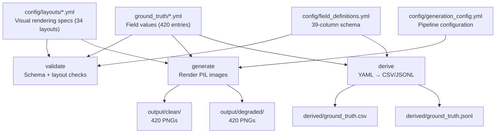

# Synthetic Business Document Generator

YAML-driven pipeline for generating synthetic Australian business documents with pixel-perfect ground truth. Produces 840 benchmark images (420 clean + 420 degraded) across 8 document types with transaction linking and trust distribution compliance ground truth.

---

## Quick Start

```bash
# Validate ground truth against schema and layout registries
python -m generators.pipeline validate

# Generate all 840 images (420 clean + 420 degraded)
python -m generators.pipeline generate

# Generate only one document type
python -m generators.pipeline generate --type receipts

# Generate clean images only (skip degradation)
python -m generators.pipeline generate --clean-only

# Regenerate derived CSV/JSONL from YAML ground truth
python -m generators.pipeline derive
```

### Dependencies

```
Pillow    # Image rendering
numpy     # Noise generation for degradation
PyYAML    # YAML parsing
typer     # CLI framework
rich      # Coloured console output
```

---

## What It Produces

| Output | Count | Description |
|--------|-------|-------------|
| Clean PNGs | 420 | Pixel-perfect rendered documents |
| Degraded PNGs | 420 | Simulated phone photos with noise, blur, rotation, JPEG artifacts |
| Ground truth YAML | 8 files | Field-level truth for all 420 documents |
| Transaction links YAML | 1 file | 110 receipt/invoice-to-bank-statement links at 3 difficulty levels |
| Trust distribution links YAML | 1 file | 50 four-document quads with compliance ground truth |
| Derived CSV | 1 file | Flat CSV with all 39 columns (NOT_FOUND for inapplicable fields) |
| Derived JSONL | 1 file | One JSON object per document with all field values |

## Document Types

### Business Documents (220 entries)

| Type | Count | Layouts | Fields | Example Layouts |
|------|-------|---------|--------|-----------------|
| Bank Statement | 55 | 12 | 9 | CBA classic/modern/minimal, Westpac, NAB, ANZ |
| Receipt | 55 | 6 | 12 | Thermal 80mm/57mm, retail tax, fuel, professional, hospitality |
| Invoice | 55 | 4 | 14 | Standard, GST-inclusive, high-value, mixed |
| CC Statement | 55 | 8 | 11 | 2 per bank (CBA, Westpac, NAB, ANZ) |

### Trust Distribution Documents (200 entries)

| Type | Count | Layouts | Fields | Description |
|------|-------|---------|--------|-------------|
| Trust Tax Return | 50 | 1 | 14 | ATO NAT 0660-inspired, Items 55/57/58 |
| Distribution Statement | 50 | 1 | 15 | Custom letterhead with distribution components |
| Trust Income Schedule | 50 | 1 | 9 | ATO-style grid with label codes (U, Q, M, C) |
| Beneficiary ITR | 50 | 1 | 7 | ATO NAT 2541-inspired, Item 13 |

Each trust distribution case generates a **quad** of 4 linked documents that share 5 scalar linking fields:

| Linking Field | Trust Return | Distribution Statement | Trust Income Schedule | Beneficiary ITR |
|---------------|-------------|----------------------|----------------------|-----------------|
| Trust ABN | TRUST_ABN | TRUST_ABN | TRUST_ABN | -- |
| Beneficiary TFN | BENEFICIARY_TFN | BENEFICIARY_TFN | BENEFICIARY_TFN | INDIVIDUAL_TFN |
| Share of Net Income | SHARE_OF_NET_INCOME | SHARE_OF_NET_INCOME | SHARE_OF_NET_INCOME | TOTAL_TRUST_INCOME |
| Franking Credit | FRANKING_CREDIT | FRANKING_CREDIT | FRANKING_CREDIT | TRUST_FRANKING_CREDIT |
| Capital Gain Component | CAPITAL_GAIN_COMPONENT | CAPITAL_GAIN_COMPONENT | CAPITAL_GAIN_COMPONENT | -- |

---

## Pipeline CLI

```
python -m generators.pipeline <command> [OPTIONS]
```

| Command | Description |
|---------|-------------|
| `validate` | Validate ground truth YAML against schema + layout registries |
| `generate` | Render document images from ground truth + layouts |
| `derive` | Regenerate CSV/JSONL from ground truth YAML |

| Flag | Default | Applies To | Description |
|------|---------|------------|-------------|
| `--config` | `config/generation_config.yml` | all | Path to generation config |
| `--type` | all types | generate | Generate only this document type |
| `--clean-only` | `false` | generate | Skip degraded variants |

---

## Architecture



---

## Ground Truth YAML Format

YAML is the single source of truth. Each entry specifies a layout reference, degradation seed, and field values:

```yaml
CASE001:
  layout: receipt_thermal_80mm
  degradation_seed: 1001
  fields:
    DOCUMENT_TYPE: RECEIPT
    SUPPLIER_NAME: Bunnings Warehouse
    BUSINESS_ABN: '53 004 085 616'
    BUSINESS_ADDRESS: '123 Main St, Alexandria NSW 2015'
    INVOICE_DATE: '15/03/2024'
    IS_GST_INCLUDED: 'true'
    GST_AMOUNT: '6.12'
    TOTAL_AMOUNT: '67.32'
    LINE_ITEM_DESCRIPTIONS: Drill Bit|Glue|Glasses
    LINE_ITEM_QUANTITIES: '1|2|1'
    LINE_ITEM_PRICES: '12.50|8.95|15.42'
    LINE_ITEM_TOTAL_PRICES: '12.50|17.90|15.42'
```

---

## Transaction Links

`ground_truth/transaction_links.yml` maps receipts and invoices to bank statement debit transactions at three difficulty levels:

| Difficulty | Criteria | Count |
|------------|----------|-------|
| Easy | Exact date and amount match | ~50 |
| Medium | Amount match, date offset 1-3 days | ~30 |
| Hard | Amount match, date offset 3-7 days | ~28 |

```yaml
# Keys are image filenames; source and target share the same CASE### prefix
CASE001_receipt_thermal_80mm.png:
- bank_statement: CASE001_cba_standard.png
  supplier: Bunnings Warehouse
  receipt_date: '15/03/2024'
  receipt_total: '67.32'
  bank_date: '15/03/2024'
  bank_description: EFTPOS BUNNINGS W/HOUSE Alexandria AUS
  bank_amount: '67.32'
  match_status: FOUND
  match_difficulty: easy
```

---

## Trust Distribution Links

`ground_truth/trust_distribution_links.yml` maps each distribution statement to its corresponding trust return, trust income schedule, and beneficiary ITR, forming a 4-document quad with compliance ground truth.

### Compliance Split

| Category | Count | Description |
|----------|-------|-------------|
| Compliant | 35 | All 5 linking fields reconcile across all 4 documents |
| Non-compliant | 15 | Deliberate amount discrepancies between documents |

### Non-Compliance Types

| Discrepancy Type | Count | Description |
|------------------|-------|-------------|
| `under_reported_income` | 5 | Beneficiary ITR reports 60-90% of actual share of net income |
| `over_claimed_franking` | 4 | Beneficiary ITR claims 110-150% of actual franking credit |
| `missing_cgt` | 3 | Trust Income Schedule shows $0 CGT despite Distribution Statement having a non-zero amount |
| `trust_return_mismatch` | 3 | Trust Return share of income differs from Distribution Statement by 5-20% |

### Link Format

```yaml
CASE201_distribution_statement_standard.png:
  trust_return: CASE201_trust_return_standard.png
  trust_income_schedule: CASE201_trust_income_schedule_standard.png
  beneficiary_itr: CASE201_beneficiary_itr_standard.png
  linking_fields:
    trust_abn: '51 196 744 081'
    beneficiary_tfn: '425 478 019'
    share_of_net_income: '88412.31'
    franking_credit: '5846.90'
    capital_gain_component: '29467.88'
  compliance_status: compliant    # or "non_compliant"
  discrepancy_type: null          # or one of the 4 types above
  discrepancy_details: null       # human-readable description
  match_status: FOUND
```

---

## Linking Validation API

### Transaction Linking (2-document pairs)

```python
from linking.transaction_matcher import parse_amount, normalize_date, description_score
from linking.link_validator import validate_links, LinkScore

# Parse amounts: handles "$1,234.56", negatives, NOT_FOUND
amount = parse_amount("$1,234.56")  # 1234.56

# Normalize dates: DD/MM/YYYY, DD/MM/YY, DD Mon YYYY, YYYY-MM-DD
d = normalize_date("15/03/2024")  # date(2024, 3, 15)

# Fuzzy description matching (SequenceMatcher)
score = description_score("BUNNINGS WAREHOUSE", "Bunnings Whse")  # ~0.6

# Score predictions against ground truth
result: LinkScore = validate_links(ground_truth_dict, predictions_dict)
print(f"F1: {result.f1:.2f}, by difficulty: {result.by_difficulty}")
```

### Trust Distribution Linking (4-document quads)

```python
from linking.link_validator import (
    validate_trust_distribution_links,
    TrustDistributionScore,
)

# Score quad linking + compliance detection
result: TrustDistributionScore = validate_trust_distribution_links(
    ground_truth_dict, predictions_dict
)

# Linking accuracy: fraction of quads where all 5 fields match across all 4 docs
print(f"Link accuracy: {result.link_accuracy:.2f} ({result.correct_quads}/{result.total_quads})")

# Compliance detection metrics
print(f"Detection rate: {result.compliance.detection_rate:.2f}")
print(f"False positive rate: {result.compliance.false_positive_rate:.2f}")
print(f"Classification accuracy: {result.compliance.classification_accuracy:.2f}")
```

---

## Degradation Pipeline

Simulates phone photos of printed documents with a deterministic 7-stage pipeline:

1. **Paper tint** -- off-white/yellowed overlay
2. **Contrast reduction**
3. **Brightness variation**
4. **Gaussian blur**
5. **Rotation** (slight skew)
6. **Salt-and-pepper noise**
7. **JPEG compression artifacts**

All parameters are configurable in `generation_config.yml` under `degradation:`. Each entry's `degradation_seed` ensures reproducible results.

### Camera-scan degradation (receipts)

The 7-stage pipeline above models a flatbed-style scan: a frame-filling page with only a slight in-plane skew. Production receipts, however, are **phone photos of a receipt lying on a flat surface** — the receipt occupies a *sub-region* of the frame and is **perspective-distorted (trapezoid) and rotated**, surrounded by background. `degrade_camera_scan.py` regenerates `output/degraded/receipts/` to model this real case.

It assumes a **cooperative capture** (the user is trying to take a good photo), so the distortion is realistic, not worst-case:

- receipt fills ~75–88% of the frame (modest background margin)
- mild rotation (±8°) and slight perspective foreshorten (2–8%)
- soft drop shadow, lighting gradient, mild blur, sensor noise, JPEG compression

The perspective warp uses **OpenCV** (`cv2.getPerspectiveTransform` / `cv2.warpPerspective`) — the same homography a rectification preprocessor inverts, so degrade and rectify are exact numerical inverses (clean round-trip validation). Compositing and photometrics stay in PIL/NumPy, all in RGB order (no BGR swap). Output keeps the existing `CASE*_receipt_*_degraded.png` names and is deterministic (seed = CASE number).

```bash
# Regenerate all 55 degraded receipts (overwrites output/degraded/receipts/)
python degrade_camera_scan.py --batch output

# Single receipt (clean -> degraded), explicit seed
python degrade_camera_scan.py \
    output/clean/receipts/CASE001_receipt_thermal_80mm.png /tmp/CASE001.png 1
```

**Dependency:** `opencv-python-headless` (cv2), in addition to the base Pillow/numpy. Install into the `du` env, e.g. `uv pip install opencv-python-headless`, or add it to `environment.yml`.

Tunable knobs in `degrade()`: `pad_*` (frame coverage), `deg` (rotation range), `f` (perspective strength), and the blur/noise/JPEG ranges.

### Rectification — undoing the camera scan (offline preprocessing)

`rectify_camera_scan.py` is the **inverse** of the camera-scan degradation: it detects the receipt quadrilateral on the flat background and applies a 4-point perspective transform to recover an upright, cropped, frontal receipt. It runs **offline** as a preprocessing pass, so the downstream VLM consumes already-rectified images and the inference environment needs no OpenCV.

Pipeline: grayscale → blur → Canny edges → dilate → largest external contour → 4-point polygon → `cv2.getPerspectiveTransform` / `cv2.warpPerspective`. It uses the **same** homography library `degrade_camera_scan.py` warps with, so degrade and rectify are exact numerical inverses (clean round-trip). **Fail-open:** if no convincing quad is found (no 4-gon, too small, or too large), the image passes through unchanged — a missed rectification is cheap; a wrong crop that drops a row is a regression.

```bash
# Rectify all degraded receipts: output/degraded/receipts/ -> output/rectified/receipts/
python rectify_camera_scan.py --batch output

# Single image
python rectify_camera_scan.py \
    output/degraded/receipts/CASE001_receipt_thermal_80mm_degraded.png /tmp/CASE001.png
```

On the 55 camera-scan receipts the quad is detected 55/55 (100%), recovering close to the original clean dimensions (e.g. CASE001 clean 420×354 → degraded → rectified 427×359). **Dependency:** `opencv-python-headless` (cv2), same as the degrader. Tunable knobs in `detect_document_quad()`: `min_area_frac` / `max_area_frac` (reject spurious tiny / full-frame quads).

---

## Regenerating the Dataset

### Business Documents (CASE001-CASE220)

```bash
# Re-seed ground truth (220 entries, deterministic with seed=42)
python scripts/seed_ground_truth.py

# Re-seed transaction links (110 links across 3 difficulty levels)
python scripts/seed_transaction_links.py
```

### Trust Distribution Documents (CASE201-CASE250)

```bash
# Re-seed trust distribution ground truth (50 quads = 200 entries, seed=42)
python scripts/seed_trust_distributions.py

# Re-seed trust distribution links (50 quad links with compliance labels)
python scripts/seed_trust_distribution_links.py
```

### Generate and Validate

```bash
# Validate all ground truth against schema
python -m generators.pipeline validate

# Generate all 840 images
python -m generators.pipeline generate

# Generate only trust distribution images
python -m generators.pipeline generate --type trust_returns
python -m generators.pipeline generate --type distribution_statements
python -m generators.pipeline generate --type trust_income_schedules
python -m generators.pipeline generate --type beneficiary_itrs

# Regenerate derived CSV/JSONL
python -m generators.pipeline derive
```

---

## Remote Image Generation

The image generation pipeline runs on any machine with the `du` conda environment. To generate the trust distribution linking images on a remote GPU server (where LMM inference will run):

### 1. Sync the repo to the remote server

```bash
rsync -avz --exclude='output/' --exclude='.git/' \
    . remote_host:/path/to/Synthetic_Doc_Generation/
```

### 2. Generate images on the remote server

```bash
ssh remote_host

cd /path/to/Synthetic_Doc_Generation

# Install dependencies (first time only)
conda env create -f environment.yml
# or update existing environment
conda env update -f environment.yml --prune

# Validate ground truth
conda run -n du python -m generators.pipeline validate

# Generate clean images only (recommended for LMM evaluation)
conda run -n du python -m generators.pipeline generate --clean-only

# Or generate only the trust distribution types
conda run -n du python -m generators.pipeline generate --type trust_returns --clean-only
conda run -n du python -m generators.pipeline generate --type distribution_statements --clean-only
conda run -n du python -m generators.pipeline generate --type trust_income_schedules --clean-only
conda run -n du python -m generators.pipeline generate --type beneficiary_itrs --clean-only
```

### 3. Verify the generated images

After generation, the output directory contains:

```
output/
├── clean/
│   ├── trust_returns/           # 50 PNGs (CASE201-CASE250)
│   ├── distribution_statements/ # 50 PNGs
│   ├── trust_income_schedules/  # 50 PNGs
│   └── beneficiary_itrs/       # 50 PNGs
└── degraded/                    # Same structure (if not using --clean-only)
```

The linking ground truth at `ground_truth/trust_distribution_links.yml` references these filenames directly. Each entry keys on the distribution statement filename and maps to the other 3 documents in the quad, with the 5 linking field values and compliance labels needed for evaluation.

### 4. Run LMM evaluation

Use the linking ground truth to evaluate an LMM's ability to:

1. **Cross-document linking** -- given 4 documents, identify the 5 shared linking fields
2. **Compliance detection** -- flag cases where amounts don't reconcile across documents
3. **Discrepancy classification** -- identify the specific type of non-compliance

```python
import yaml
from linking.link_validator import validate_trust_distribution_links

# Load ground truth
with open("ground_truth/trust_distribution_links.yml") as f:
    ground_truth = yaml.safe_load(f)

# predictions: dict mapping distribution_statement filename -> {
#     trust_return, trust_income_schedule, beneficiary_itr,
#     linking_fields: {trust_abn, beneficiary_tfn, share_of_net_income,
#                      franking_credit, capital_gain_component},
#     compliance_status, discrepancy_type
# }
predictions = your_lmm_extraction_function(ground_truth)

result = validate_trust_distribution_links(ground_truth, predictions)
print(f"Link accuracy: {result.link_accuracy:.2%}")
print(f"Compliance detection rate: {result.compliance.detection_rate:.2%}")
print(f"False positive rate: {result.compliance.false_positive_rate:.2%}")
```

---

## File Structure

```
degrade_camera_scan.py         # Camera-scan degradation for receipts (cv2 perspective warp)
rectify_camera_scan.py         # Offline rectification: detect quad + 4-point transform (inverse)

generators/
├── __init__.py
├── common.py                  # Fonts, text helpers, ABN/TFN validation, GST, degradation
├── schema.py                  # Ground truth schema validation
├── loader.py                  # YAML loaders with fail-fast diagnostics
├── derive_outputs.py          # YAML → CSV/JSONL derivation
├── pipeline.py                # Typer CLI (validate, generate, derive)
├── bank_statement.py          # Bank statement renderer
├── receipt.py                 # Receipt renderer (thermal/letterhead)
├── invoice.py                 # Tax-compliant invoice renderer
├── cc_statement.py            # Credit card statement renderer
├── trust_return.py            # Trust tax return renderer (NAT 0660-inspired)
├── distribution_statement.py  # Distribution statement renderer
├── trust_income_schedule.py   # Trust income schedule renderer
└── beneficiary_itr.py         # Beneficiary ITR renderer (NAT 2541-inspired)

linking/
├── __init__.py
├── transaction_matcher.py     # parse_amount, normalize_date, normalize_tfn
└── link_validator.py          # validate_links, validate_trust_distribution_links

scripts/
├── seed_ground_truth.py              # Generate 220 business document entries (seed=42)
├── seed_transaction_links.py         # Generate 110 transaction links
├── seed_trust_distributions.py       # Generate 200 trust distribution entries (seed=42)
└── seed_trust_distribution_links.py  # Generate 50 quad links with compliance labels

ground_truth/
├── bank_statements.yml               # 55 entries
├── receipts.yml                       # 55 entries
├── invoices.yml                       # 55 entries
├── cc_statements.yml                  # 55 entries
├── trust_returns.yml                  # 50 entries
├── distribution_statements.yml        # 50 entries
├── trust_income_schedules.yml         # 50 entries
├── beneficiary_itrs.yml               # 50 entries
├── transaction_links.yml              # 110 receipt/invoice-to-bank links
└── trust_distribution_links.yml       # 50 quad links with compliance ground truth

config/
├── generation_config.yml      # Pipeline configuration (8 document types)
├── field_definitions.yml      # 39-column schema for 8 document types
├── data_pools.yml             # Australian business data, trust names, trustee names
└── layouts/
    ├── bank_statements.yml          # 12 layouts
    ├── receipts.yml                 # 6 layouts
    ├── invoices.yml                 # 4 layouts
    ├── cc_statements.yml            # 8 layouts
    ├── trust_returns.yml            # 1 layout
    ├── distribution_statements.yml  # 1 layout
    ├── trust_income_schedules.yml   # 1 layout
    └── beneficiary_itrs.yml         # 1 layout
```
