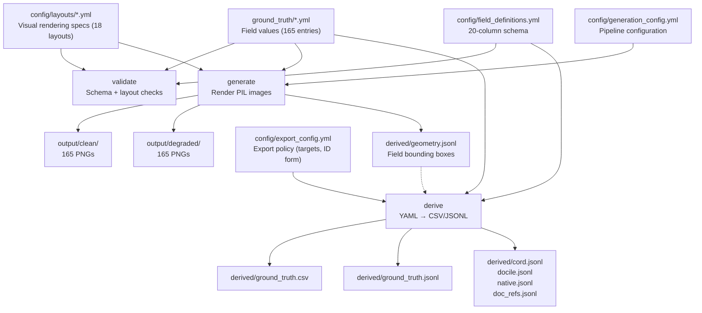

# Synthetic Business Document Generator

YAML-driven pipeline for generating synthetic Australian business documents with pixel-perfect ground truth. Produces 330 benchmark images (165 clean + 165 degraded) across 3 document types — bank statements, receipts, invoices — with transaction-linking ground truth.

---

## Quick Start

```bash
# Validate ground truth against schema and layout registries
python -m generators.pipeline validate

# Generate all 330 images (165 clean + 165 degraded)
python -m generators.pipeline generate

# Generate only one document type
python -m generators.pipeline generate --type receipts

# Generate clean images only (skip degradation)
python -m generators.pipeline generate --clean-only

# Regenerate derived CSV/JSONL from YAML ground truth
python -m generators.pipeline derive
```

### Extraction ground truth for LMM_POC

`derive` emits this repo's own 165-row `derived/ground_truth.csv`. To build the
equivalent **extraction CSV** that LMM_POC's `evaluate` stage consumes — columns and
formatting taken from LMM_POC's schema — use:

```bash
python scripts/generate_extraction_gt.py \
    --output   /path/to/evaluation_data/<dataset>/ground_truth_extraction.csv \
    --data-dir /path/to/evaluation_data/<dataset>   # optional: validates filenames
```

No other checkout is needed. The columns and value formatting come from
`config/extraction_schema.yml` — the **extraction** contract, defining what a model
is asked for and scored on.

That is a different file from `config/field_definitions.yml`, the **generation**
contract describing what the renderers draw. They differ deliberately: bank
statements carry `ACCOUNT_BALANCE` and `TRANSACTION_DESCRIPTIONS` when generated but
are a 5-field extraction task; receipts show no payer, yet `PAYER_NAME` and
`PAYER_ADDRESS` are still scored, because the prompt asks for them and the right
answer is `NOT_FOUND` — that is how a hallucinated payer gets caught. Pass the
generation contract by mistake and the script refuses with a diagnostic rather than
emitting a wrongly-shaped CSV.

`--data-dir` is worth passing: it warns when a generated filename is missing from the
image directory, which is how you catch ground truth and images having drifted apart.

### Scoring a model against that ground truth

`field_f1_standalone.ipynb` reads a model's `raw_extractions.jsonl` plus a ground-truth
file and reports F1 per extraction field, by document type, macro and micro. It is
fully standalone — pandas and the standard library only, no imports from this repo or
LMM_POC — so it runs here with no other checkout. Set the paths and the per-document-type
field lists in its config cell; the field lists must match the prompt your model was
given, since that is what defines a fair scoring set.

### Dependencies

```
Pillow                  # Image rendering
numpy                   # Noise generation for degradation
PyYAML                  # YAML parsing
typer                   # CLI framework
rich                    # Coloured console output
Faker                   # Fictional en_AU people and addresses
opencv-python-headless  # Camera-scan degrade/rectify (cv2 perspective warp)
apted                   # MIT tree-edit-distance backend for CORD scoring
rapidfuzz               # Fuzzy string matching
docile-benchmark        # Published DocILE KILE/LIR scorer (self-score check)
```

All dependencies are pinned in `environment.yml` (conda env `synthetic`).

---

## What It Produces

| Output | Count | Description |
|--------|-------|-------------|
| Clean PNGs | 165 | Pixel-perfect rendered documents |
| Degraded PNGs | 165 | Simulated phone photos with noise, blur, rotation, JPEG artifacts |
| Ground truth YAML | 3 files | Field-level truth for all 165 documents |
| Transaction links YAML | 1 file | 110 receipt/invoice-to-bank-statement links at 3 difficulty levels |
| Derived CSV | 1 file | Flat CSV with all 21 columns (image_file + 20 fields; NOT_FOUND for inapplicable fields) |
| Derived JSONL | 1 file | One JSON object per document with all field values |
| Geometry JSONL | 165 records | Per-document field bounding boxes (relative coords), captured at draw time during `generate` |
| CORD JSONL | 110 records | Receipts + invoices as CORD Donut-style `gt_parse` value trees |
| DocILE JSONL | 55 records | Invoices as DocILE KILE + LIR fields with bounding boxes |
| Native JSONL | 55 records | Bank statements in a project-defined schema |
| doc_refs JSONL | 110 records | Receipt/invoice-to-bank transaction links in FinBalance-style `doc_refs` |

## Document Types (165 entries)

| Type | Count | Layouts | Fields | Example Layouts |
|------|-------|---------|--------|-----------------|
| Bank Statement | 55 | 8 | 9 | 2 per bank (CBA, Westpac, NAB, ANZ) |
| Receipt | 55 | 6 | 12 | Thermal 80mm/57mm, retail tax, fuel, professional, hospitality |
| Invoice | 55 | 4 | 14 | Standard, GST-inclusive, high-value, mixed |

---

## Pipeline CLI

```
python -m generators.pipeline <command> [OPTIONS]
```

| Command | Description |
|---------|-------------|
| `validate` | Validate ground truth YAML against schema + layout registries |
| `generate` | Render document images from ground truth + layouts |
| `derive` | Regenerate CSV/JSONL from ground truth YAML |
| `eval-set` | Export a flat evaluation set (one clean image per document) for LMM_POC |

| Flag | Default | Applies To | Description |
|------|---------|------------|-------------|
| `--config` | `config/generation_config.yml` | all | Path to generation config |
| `--type` | all types | generate | Generate only this document type |
| `--clean-only` | `false` | generate | Skip degraded variants |

---

## Architecture



> `derive` emits the CSV/JSONL always, and each benchmark view (`cord`, `docile`, `native`, `doc_refs`) only when it is listed under `export_targets` in `config/export_config.yml`. The DocILE export reads `derived/geometry.jsonl`, which is written by `generate`.

---

## Ground Truth YAML Format

YAML is the single source of truth. Each entry specifies a layout reference, degradation seed, and field values:

```yaml
CASE001:
  layout: receipt_fuel
  degradation_seed: 8967
  fields:
    DOCUMENT_TYPE: RECEIPT
    SUPPLIER_NAME: Ravensdale Health Store   # fully fictional; screened against a real-name blocklist
    BUSINESS_ABN: '79 104 332 181'           # generated, valid checksum (never a real ABN)
    BUSINESS_ADDRESS: '400 Stewart Rd, South Yarra VIC 3141'
    INVOICE_DATE: '02/03/2023'
    IS_GST_INCLUDED: 'true'
    GST_AMOUNT: '1.24'
    TOTAL_AMOUNT: '13.60'
    LINE_ITEM_DESCRIPTIONS: Dishwashing Liquid|Bandaids 40pk
    LINE_ITEM_QUANTITIES: '1|1'
    LINE_ITEM_PRICES: '4.73|8.87'
    LINE_ITEM_TOTAL_PRICES: '4.73|8.87'
```

---

## Content Generation & Guarantees

All ground-truth content is generated from `config/data_pools.yml` through a shared engine (`generators/content_engine.py`), driven by the two seed scripts. The corpus carries three guarantees **by construction**:

### Fully fictional — no real entities

People and addresses come from Faker (`en_AU`); businesses are invented from curated name-parts and paired with generated ABNs (valid checksums, never real). Every generated name is screened against a **real-name blocklist** — the real retailers/professional services listed in `data_pools.yml` plus a curated list — so no real business, person, or ABN is ever emitted (the real names exist only to seed the blocklist). Entity selection uses seeded non-repeating sampling, so entities vary and de-correlate across documents instead of repeating in lockstep.

### Deterministic & reproducible

The seed scripts run at `seed=42`, seeding the local RNG, Faker, and the module-global RNG behind `generate_abn`/`generate_tfn`, so re-running them reproduces a **byte-identical** corpus. The dataset is fully regenerable and any change is diffable run-to-run.

### Fit-safe — no silent clipping

Every variable field is drawn through `fit_text` against per-layout pixel budgets (`config/layouts/*.yml` `field_budgets:`, loaded by `generators/layout_budgets.py`): text that doesn't fit **wraps or shrinks losslessly**, and a genuinely impossible fit raises `FitError`. The `validate` command runs an overflow backstop (`generators/overflow_check.py`) across all 3 document types, so no rendered field can silently truncate — a benchmark-corrupting failure fails loudly instead.

`config/data_pools.yml` is the single source of content (fictional business name-parts, Faker config, product/service catalogs, bank-description grammar, street types, category partitions, and the real-name blocklist). Python holds no content constants; a missing pool key fails fast with a diagnostic.

---

## Benchmark Export Schemas

Beyond the flat `ground_truth.csv`/`.jsonl`, the `derive` command re-projects the corpus onto standard document-AI benchmark schemas so results are comparable to public leaderboards. The mapping code lives in `generators/exporters/` and the policy in `config/export_config.yml` (every key required, no silent defaults).

The authoritative field maps and worked examples are in [`docs/GroundTruth_Export_Spec.md`](docs/GroundTruth_Export_Spec.md) (normalisation §3, CORD §4, DocILE §5, doc_refs §6, native §7). Each exporter module's docstring cites the spec section it implements.

| Target | File | Scope | Schema |
|--------|------|-------|--------|
| `cord` | `derived/cord.jsonl` | Receipts + invoices (110) | CORD Donut-style `gt_parse` value trees. Fields with no CORD slot (supplier, ABN, address, date, payer) go under an `extension` subtree |
| `docile` | `derived/docile.jsonl` | Invoices only (55) | DocILE KILE + LIR fields, each with a bounding box from `geometry.jsonl` |
| `native` | `derived/native.jsonl` | Bank statements (55) | Project-defined schema for types with no public equivalent |
| `doc_refs` | `derived/doc_refs.jsonl` | Transaction links (110) | FinBalance-style cross-document `doc_refs` |

Which targets are emitted is controlled by `export_targets:` in `config/export_config.yml`. To ship a target as a no-op, remove it from that list. Do not delete the key.

### Export policy (`config/export_config.yml`)

| Key | Purpose |
|-----|---------|
| `abn_tfn_canonical_form` | Form emitted in `text` (`spaced` — what the renderer draws, so what a VLM reads) |
| `abn_tfn_equality_form` | Form used for internal equality checks (`digits_only`) |
| `cord_extension_scoring` | Whether the `extension` subtree counts toward the headline CORD score (`excluded_scored_separately` keeps the number leaderboard-comparable) |
| `export_targets` | List of derived views to emit |
| `docile_fieldtypes` | Ground-truth column → DocILE field-type map (verified byte-exact against `rossumai/docile`) |

### Scoring

The export layer ships self-scoring so the mappings are provably lossless:

- **CORD** — `generators/exporters/cord_eval.py` is a vendored, `apted`-backed port of Donut's `JSONParseEvaluator` (MIT `apted` replaces the GPL-adjacent `zss`; original Donut MIT licence reproduced in-file). `cord_score.py` applies the `cord_extension_scoring` policy.
- **DocILE** — scored via the published `docile-benchmark` KILE/LIR scorer; the test suite asserts a perfect self-score and that corrupting a single box or field-type degrades only the expected metric.

---

## Transaction Links

`ground_truth/transaction_links.yml` maps receipts and invoices to bank statement debit transactions at three difficulty levels:

| Difficulty | Criteria | Count |
|------------|----------|-------|
| Easy | Exact date and amount match | 52 |
| Medium | Amount match, date offset 1-3 days | 36 |
| Hard | Amount match, date offset 3-7 days | 22 |

```yaml
# Keys are image filenames; source and target share the same CASE### prefix
CASE001_receipt_fuel.png:
- bank_statement: CASE001_cba_standard.png
  supplier: Ravensdale Health Store
  receipt_date: '02/03/2023'
  receipt_total: '13.60'
  bank_date: '02/03/2023'
  bank_description: VISA DEBIT PURCHASE RAVENSDALE HEALTH STORE Alexandria AU
  bank_amount: '13.60'
  match_status: FOUND
  match_difficulty: easy
  notes: Early row on cba standard — exact date and amount match
```

---

## Linking Validation API

### Transaction Linking (2-document pairs)

```python
from linking.transaction_matcher import parse_amount, normalize_date, description_score
from linking.link_validator import validate_links, LinkScore

# Parse amounts: handles "$1,234.56", negatives, NOT_FOUND
amount = parse_amount("$1,234.56")  # 1234.56

# Normalize dates: DD/MM/YYYY, DD/MM/YY, DD Mon YYYY, YYYY-MM-DD
d = normalize_date("15/03/2024")  # date(2024, 3, 15)

# Fuzzy description matching (SequenceMatcher)
score = description_score("RAVENSDALE HEALTH STORE", "Ravensdale Hlth Store")  # ~0.95

# Score predictions against ground truth
result: LinkScore = validate_links(ground_truth_dict, predictions_dict)
print(f"F1: {result.f1:.2f}, by difficulty: {result.by_difficulty}")
```

---

## Degradation Pipeline

Simulates phone photos of printed documents with a deterministic 7-stage pipeline:

1. **Paper tint** -- off-white/yellowed overlay
2. **Contrast reduction**
3. **Brightness variation**
4. **Gaussian blur**
5. **Rotation** (slight skew)
6. **Salt-and-pepper noise**
7. **JPEG compression artifacts**

All parameters are configurable in `generation_config.yml` under `degradation:`. Each entry's `degradation_seed` ensures reproducible results.

### Camera-scan degradation (receipts)

The 7-stage pipeline above models a flatbed-style scan: a frame-filling page with only a slight in-plane skew. Production receipts, however, are **phone photos of a receipt lying on a flat surface** — the receipt occupies a *sub-region* of the frame and is **perspective-distorted (trapezoid) and rotated**, surrounded by background. `degrade_camera_scan.py` regenerates `output/degraded/receipts/` to model this real case.

It assumes a **cooperative capture** (the user is trying to take a good photo), so the distortion is realistic, not worst-case:

- receipt fills ~75–88% of the frame (modest background margin)
- mild rotation (±8°) and slight perspective foreshorten (2–8%)
- soft drop shadow, lighting gradient, mild blur, sensor noise, JPEG compression

The perspective warp uses **OpenCV** (`cv2.getPerspectiveTransform` / `cv2.warpPerspective`) — the same homography a rectification preprocessor inverts, so degrade and rectify are exact numerical inverses (clean round-trip validation). Compositing and photometrics stay in PIL/NumPy, all in RGB order (no BGR swap). Output keeps the existing `CASE*_receipt_*_degraded.png` names and is deterministic (seed = CASE number).

```bash
# Regenerate all 55 degraded receipts (overwrites output/degraded/receipts/)
python degrade_camera_scan.py --batch output

# Single receipt (clean -> degraded), explicit seed
python degrade_camera_scan.py \
    output/clean/receipts/CASE001_receipt_fuel.png /tmp/CASE001.png 1
```

**Dependency:** `opencv-python-headless` (cv2), in addition to the base Pillow/numpy — used by the camera-scan scripts. It is included in `environment.yml` (resolved from your configured PyPI index, e.g. an internal mirror on locked-down hosts).

Tunable knobs in `degrade()`: `pad_*` (frame coverage), `deg` (rotation range), `f` (perspective strength), and the blur/noise/JPEG ranges.

### Rectification — undoing the camera scan (offline preprocessing)

`rectify_camera_scan.py` is the **inverse** of the camera-scan degradation: it detects the receipt quadrilateral on the flat background and applies a 4-point perspective transform to recover an upright, cropped, frontal receipt. It runs **offline** as a preprocessing pass, so the downstream VLM consumes already-rectified images and the inference environment needs no OpenCV.

Pipeline: grayscale → blur → Canny edges → dilate → largest external contour → 4-point polygon → `cv2.getPerspectiveTransform` / `cv2.warpPerspective`. It uses the **same** homography library `degrade_camera_scan.py` warps with, so degrade and rectify are exact numerical inverses (clean round-trip). **Fail-open:** if no convincing quad is found (no 4-gon, too small, or too large), the image passes through unchanged — a missed rectification is cheap; a wrong crop that drops a row is a regression.

```bash
# Rectify all degraded receipts: output/degraded/receipts/ -> output/rectified/receipts/
python rectify_camera_scan.py --batch output

# Single image
python rectify_camera_scan.py \
    output/degraded/receipts/CASE001_receipt_fuel_degraded.png /tmp/CASE001.png
```

On the 55 camera-scan receipts the quad is detected 55/55 (100%), recovering close to the original clean dimensions (e.g. CASE001 clean 420×374 → degraded 516×490 → rectified 425×380). **Dependency:** `opencv-python-headless` (cv2), same as the degrader. Tunable knobs in `detect_document_quad()`: `min_area_frac` / `max_area_frac` (reject spurious tiny / full-frame quads).

---

## Regenerating the Dataset

### Document Generation (CASE001-CASE055)

```bash
# Re-seed ground truth (165 entries, deterministic with seed=42)
python scripts/seed_ground_truth.py

# Re-seed transaction links (110 links across 3 difficulty levels)
python scripts/seed_transaction_links.py
```

### Generate and Validate

```bash
# Validate all ground truth against schema
python -m generators.pipeline validate

# Generate all 330 images
python -m generators.pipeline generate

# Regenerate derived CSV/JSONL
python -m generators.pipeline derive
```

---

## File Structure

```
degrade_camera_scan.py         # Camera-scan degradation for receipts (cv2 perspective warp)
rectify_camera_scan.py         # Offline rectification: detect quad + 4-point transform (inverse)

generators/
├── __init__.py
├── common.py                  # Fonts, text helpers, ABN validation, GST, degradation, fit_text
├── content_engine.py          # Shared content generator (Faker en_AU, fictional business, blocklist, seeded sampling)
├── layout_budgets.py          # Per-field pixel-budget loader (fit-safety)
├── overflow_check.py          # Fail-fast overflow backstop — catches text that cannot fit its box (fit-safety)
├── payment_block.py           # EFTPOS terminal-slip data + receipt↔bank linking (load_link_index, derive_payment)
├── schema.py                  # Ground truth schema validation
├── loader.py                  # YAML loaders with fail-fast diagnostics
├── derive_outputs.py          # YAML → CSV/JSONL + CORD/DocILE/native/doc_refs derivation
├── eval_set.py                # Flat evaluation-set export for LMM_POC (hands off to relabel_evaluation_set.py)
├── pipeline.py                # Typer CLI (validate, generate, derive, eval-set)
├── bank_statement.py          # Bank statement renderer — draws its layout's declarative `body:` tree
├── receipt.py                 # Receipt renderer (thermal/letterhead) — same
├── invoice.py                 # Tax-compliant invoice renderer — same
├── layout_dsl/                 # Declarative layout engine: walks body: trees, dispatches blocks to primitive drawers
└── exporters/                 # Benchmark-schema export layer
    ├── config.py              # Load + fail-fast-validate export_config.yml
    ├── normalise.py           # Shared normalisation rules (pure functions)
    ├── cord.py                # Ground truth → CORD gt_parse tree
    ├── cord_eval.py           # Vendored apted-backed Donut JSONParseEvaluator
    ├── cord_score.py          # Apply cord_extension_scoring policy
    ├── docile.py              # Ground truth + geometry → DocILE KILE/LIR
    ├── geometry.py            # Draw-time bounding-box recorder (relative coords)
    ├── links.py               # Link ground truth → doc_refs records
    └── native.py              # Bank statements → native schema

linking/
├── __init__.py
├── transaction_matcher.py     # parse_amount, normalize_date, description_score
└── link_validator.py          # validate_links

scripts/
├── seed_ground_truth.py              # Generate 165 document entries (seed=42)
└── seed_transaction_links.py         # Generate 110 transaction links

ground_truth/
├── bank_statements.yml               # 55 entries
├── receipts.yml                      # 55 entries
├── invoices.yml                      # 55 entries
└── transaction_links.yml             # 110 receipt/invoice-to-bank links

config/
├── generation_config.yml      # Pipeline configuration (3 document types)
├── field_definitions.yml      # 20-column schema for 3 document types
├── export_config.yml          # Benchmark-export policy (targets, ID form, CORD/DocILE field maps)
├── data_pools.yml             # Content pools: fictional business name-parts, Faker config, product/service catalogs, real-name blocklist
└── layouts/
    ├── bank_statements.yml          # 8 layouts
    ├── receipts.yml                 # 6 layouts
    └── invoices.yml                 # 4 layouts

derived/                            # Regenerated by `generate` (geometry) and `derive` (the rest)
├── ground_truth.csv                # Flat 21-column CSV
├── ground_truth.jsonl              # One JSON object per document
├── geometry.jsonl                  # Per-document field bounding boxes (written by generate)
├── cord.jsonl                      # 110 receipt/invoice CORD gt_parse trees
├── docile.jsonl                    # 55 invoice DocILE KILE/LIR records
├── native.jsonl                    # 55 bank statement native records
└── doc_refs.jsonl                  # 110 cross-document link records

docs/
├── GroundTruth_Export_Spec.md      # Authoritative export schema: field maps, worked examples (§3-7)
└── ...                             # design/plan notes for renderers, fit-safety, content variety
```
