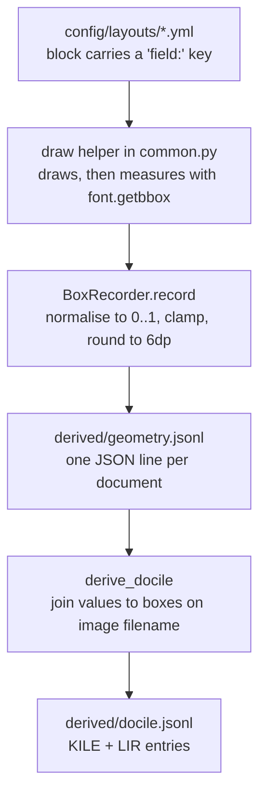

# How Bounding Boxes Get Into the Synthetic Documents

**Applies to:** invoices, receipts, bank statements.
**Source links** point at
[`main`](https://github.com/tmnestor/Synthetic_Doc_Generation) so they resolve
for a reader outside a checkout; the line numbers were current at commit
`ccaca0d` and will drift as the files change.

## The short answer

Nothing is annotated after the fact. The renderer already knows where every
string lands, so each drawing helper records its own extent *as it draws*, and
the pixel rectangle is normalised against the page and written to a parallel
geometry file.

Every text helper in
[`generators/common.py`](https://github.com/tmnestor/Synthetic_Doc_Generation/blob/main/generators/common.py)
takes two optional keyword arguments, `recorder` and `field`. When both are
supplied, the helper measures the glyphs it just drew with `font.getbbox(text)`,
adds the draw origin, and hands the rectangle to a `BoxRecorder`. Pass neither
and the helper draws exactly as before, so capture is opt-in and costs nothing
when it is off.

```python
# generators/common.py -> draw_text_right (trimmed)
bbox = font.getbbox(text)
text_width = int(bbox[2] - bbox[0])
text_height = int(bbox[3] - bbox[1])
left = x_right - text_width
draw.text((left, y), text, font=font, fill=fill)
if recorder is not None and field is not None:
    recorder.record(field, (left, y, x_right, y + text_height))
```

## The five steps



1. **Draw and measure.** The helper that puts the string on the page is the one
   that records it, so a box can never drift from the pixels.
2. **Normalise.**
   [`generators/exporters/geometry.py`](https://github.com/tmnestor/Synthetic_Doc_Generation/blob/main/generators/exporters/geometry.py)
   holds the page width and height, divides through, clamps into `[0, 1]` and
   rounds to six decimal places.
3. **Key by field.** The key is the ground-truth column name, taken from the
   layout YAML. A second box under an existing key
   [raises](https://github.com/tmnestor/Synthetic_Doc_Generation/blob/main/generators/exporters/geometry.py#L39)
   rather than overwrites: a field drawn twice has no unambiguous ground-truth
   location.
4. **Serialise.** `generate` passes an empty `geometry_out` dict to each
   renderer and collects one JSON line per document into `derived/geometry.jsonl`
   ([`generators/pipeline.py#L301-L334`](https://github.com/tmnestor/Synthetic_Doc_Generation/blob/main/generators/pipeline.py#L301-L334)).
5. **Join at export.** `derive` joins values from `ground_truth/*.yml` to boxes
   from that file on the image filename, and emits KILE and LIR entries into
   `derived/docile.jsonl`
   ([`derive_docile`](https://github.com/tmnestor/Synthetic_Doc_Generation/blob/main/generators/derive_outputs.py#L178)).

> `derived/` and `output/` are gitignored, so the geometry file is not in the
> repo. Regenerate it with `python -m generators.pipeline generate`.

## Field names come from the layout YAML

No box key is hardcoded in Python. Each block or table column in
[`config/layouts/*.yml`](https://github.com/tmnestor/Synthetic_Doc_Generation/tree/main/config/layouts)
carries a `field:` naming the ground-truth column it renders, and that string
becomes the geometry key:

```yaml
# config/layouts/invoices.yml
{type: pair, label: "Date", value: "{INVOICE_DATE}", field: INVOICE_DATE}
- {key: quantity, label: "Qty", align: left, x: 900, field: LINE_ITEM_QUANTITIES}
```

Table columns are indexed per row, so row 0 of that column is recorded as
`LINE_ITEM_QUANTITIES[0]`
([`primitives_table.py#L790-L822`](https://github.com/tmnestor/Synthetic_Doc_Generation/blob/main/generators/layout_dsl/primitives_table.py#L790-L822)).

The layout schema validator checks every `field:` against
`config/field_definitions.yml`
([`layout_dsl/schema.py#L442`](https://github.com/tmnestor/Synthetic_Doc_Generation/blob/main/generators/layout_dsl/schema.py#L442)),
because a typo there is invisible to both a pixel snapshot (the pixels are
unaffected) and a `{FIELD}` placeholder check (it is not a template).

## Three cases that needed special handling

**Labels excluded from the value box.** `"Date: 02/03/2023"` is drawn as a
single string so glyph shaping stays correct, then
[`capture_label_prefixed_value`](https://github.com/tmnestor/Synthetic_Doc_Generation/blob/main/generators/common.py#L477)
measures the label with `draw.textlength` and records only the offset value
substring. The box lands on the date alone, not on the label.

**Receipts render oversized, then crop.** Receipt length is unknown up front, so
the canvas is oversized and cropped to content afterwards.
[`rescale_vertical`](https://github.com/tmnestor/Synthetic_Doc_Generation/blob/main/generators/exporters/geometry.py#L76)
multiplies every `top` and `bottom` by `old_height / new_height`. Horizontal
fractions are untouched, since the width never changes.

**Closing-balance rows.** A bank statement's last row carries the account
balance rather than a transaction amount, so a column may declare
`last_row_field:` alongside `field:`. The two are mutually exclusive per draw.

## The stored convention

Four numbers, `[left, top, right, bottom]`, relative to the page in `[0, 1]`,
origin top-left with `y` increasing downward. That is DocILE's convention,
confirmed against `BBox.has_valid_relative_coords()`, which asserts
`0 <= left <= right <= 1` and the same for `top` and `bottom`. See
[`docs/GroundTruth_Export_Spec.md`](https://github.com/tmnestor/Synthetic_Doc_Generation/blob/main/docs/GroundTruth_Export_Spec.md)
section 5.4 for the sources that were checked, and section 9 for the
capture-and-serialise design.

```json
// derived/geometry.jsonl, one line per document
{"case_id": "CASE001",
 "image_file": "CASE001_tax_invoice_high_value.png",
 "width": 1900, "height": 3508,
 "boxes": {"SUPPLIER_NAME": [0.052632, 0.057013, 0.138947, 0.070696],
           "BUSINESS_ABN": [0.052632, 0.082098, 0.176316, 0.100342],
           "LINE_ITEM_DESCRIPTIONS[0]": [0.052632, 0.18358, 0.226842, 0.191562],
           "LINE_ITEM_PRICES[0]": [0.662632, 0.18358, 0.710526, 0.190137],
           "TOTAL_AMOUNT": [0.864737, 0.231471, 0.947368, 0.242018]}}
```

Which becomes, per field, in `derived/docile.jsonl`:

```json
{"page": 0,
 "bbox": [0.052632, 0.082098, 0.176316, 0.100342],
 "fieldtype": "vendor_registration_id",
 "text": "<the ABN string, verbatim as drawn on the page>"}
```

The `fieldtype` map lives in `config/export_config.yml` under
`docile_fieldtypes:`, and every key is required (a missing one fails fast rather
than defaulting).

## Worth knowing before you touch it

- **A missing box is a hard error, never a silent drop.** On a localisation
  benchmark, quietly skipping an unboxed field inflates precision instead of
  failing, so
  [`exporters/docile.py`](https://github.com/tmnestor/Synthetic_Doc_Generation/blob/main/generators/exporters/docile.py)
  raises with the field key and the regeneration command.
- **Recording must not redraw.** An early version of the table primitive drew a
  cell twice so it could be recorded under two keys. PIL alpha-composites each
  call's antialiased glyph mask, so the "redraw" measurably darkened every soft
  edge: 22 of 55 bank statements differed by 267 to 1109 pixels between capture
  on and capture off. The column now picks one key per draw.
- **Boxes belong to the clean render only.** The degradation stage warps
  receipts through a camera homography and carries no geometry through it, so
  the degraded set has no transformed boxes.
- **DocILE export is invoice-only.** Receipts structurally never render a unit
  price, or a quantity when it is 1, so those fields have no box to find on the
  page.

## Where to look

| Path | Role |
|---|---|
| [`generators/exporters/geometry.py`](https://github.com/tmnestor/Synthetic_Doc_Generation/blob/main/generators/exporters/geometry.py) | `BoxRecorder`, normalisation, clamping, `rescale_vertical` |
| [`generators/common.py`](https://github.com/tmnestor/Synthetic_Doc_Generation/blob/main/generators/common.py) | Draw helpers taking `recorder`/`field`; `capture_label_prefixed_value` |
| [`generators/layout_dsl/primitives_table.py`](https://github.com/tmnestor/Synthetic_Doc_Generation/blob/main/generators/layout_dsl/primitives_table.py) | Per-row `[i]` indexing, `last_row_field`, `prefix_field` |
| [`generators/invoice.py`](https://github.com/tmnestor/Synthetic_Doc_Generation/blob/main/generators/invoice.py#L26), [`receipt.py`](https://github.com/tmnestor/Synthetic_Doc_Generation/blob/main/generators/receipt.py#L23), [`bank_statement.py`](https://github.com/tmnestor/Synthetic_Doc_Generation/blob/main/generators/bank_statement.py#L79) | Build the recorder when `geometry_out` is passed |
| [`generators/pipeline.py`](https://github.com/tmnestor/Synthetic_Doc_Generation/blob/main/generators/pipeline.py#L301) | Writes `derived/geometry.jsonl` during `generate` |
| [`generators/derive_outputs.py`](https://github.com/tmnestor/Synthetic_Doc_Generation/blob/main/generators/derive_outputs.py#L178) | `derive_docile` joins values to boxes by image filename |
| [`generators/exporters/docile.py`](https://github.com/tmnestor/Synthetic_Doc_Generation/blob/main/generators/exporters/docile.py) | KILE and LIR entries: `page`, `bbox`, `fieldtype`, `text` |
| [`docs/GroundTruth_Export_Spec.md`](https://github.com/tmnestor/Synthetic_Doc_Generation/blob/main/docs/GroundTruth_Export_Spec.md) | Section 5.4 bbox convention, section 9 the capture design |

## Regenerating

```bash
conda activate synthetic
python -m generators.pipeline generate   # rewrites derived/geometry.jsonl
python -m generators.pipeline derive     # rebuilds the exports from it
```
