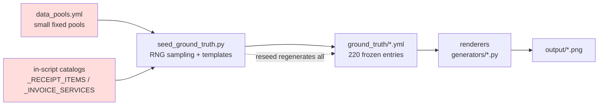

# Content Variety — Options & Analysis

> Status: investigation / options paper. Layout variety is considered adequate
> (30 layouts); this document is only about the **textual/numeric content** that
> fills those layouts.

## TL;DR

The dataset draws its content from a handful of small, hand-authored pools, so
across all 220 documents the same names, merchants, suburbs and products recur.
The fix is to **widen the content space** — through bigger pools, procedural
composition, semantic edge cases, and/or a data library like Faker — and then
**reseed** the ground truth. Recommended path: combine pool expansion +
procedural composition + edge-case injection, phased. **Critical prerequisite:**
ship *fit safety* first (per-field budgets + overflow validation, see §3a) — or
richer content will overflow the fixed layouts and silently break the
pixel-perfect ground truth.

---

## 1. Root cause

Content is composed by `scripts/seed_ground_truth.py` from fixed pools in
`config/data_pools.yml` and a few in-script catalogs. The pools are small:

| Pool | Location | Size | Notes |
|------|----------|------|-------|
| retailers | `data_pools.yml` | **20** | Real names + real ABNs |
| account holders | `data_pools.yml` | **15** | Fixed `First Last` strings |
| locations / suburbs | `data_pools.yml` | **10** | suburb + postcode + state |
| professional services | `data_pools.yml` | **5** | |
| transaction description templates | `data_pools.yml` | **~15** | `{location}`/`{ref}`/`{crn}` slots |
| bank description templates | `data_pools.yml` | **6** | eftpos, visa, bpay, dd, transfer, salary |
| banks | `data_pools.yml` | **4** | CBA, Westpac, NAB, ANZ |
| trust names / trustees | `data_pools.yml` | **25 / 25** | |
| receipt line-items (`_RECEIPT_ITEMS`) | `seed_ground_truth.py` | **25** | product + unit + price range |
| invoice services (`_INVOICE_SERVICES`) | `seed_ground_truth.py` | **15** | service + unit + rate range |
| payment methods (`_PAYMENT_METHODS`) | `seed_ground_truth.py` | **6** | |

**The consequence:** 220 documents are populated from ~15 people, ~20 merchants,
~10 suburbs and ~40 line-item types. Even with randomised amounts/dates, a reader
(human or LLM) sees the same entities over and over. Layout differs;
*content repeats*.

### Where variety is (and isn't) injected



The red nodes are the variety bottleneck. Everything downstream faithfully
renders whatever the pools produced.

---

## 2. What is Faker?

[Faker](https://faker.readthedocs.io/) is a mature open-source Python library
for generating realistic fake data.

- **Locale-aware:** `Faker('en_AU')` yields Australian names, streets, suburbs,
  states and postcodes.
- **Providers:** `name`, `address`, `company`, `phone_number`, `date_time`,
  `currency`, etc. You can register **custom providers** (e.g. a valid-ABN one).
- **Deterministic:** `Faker.seed(n)` makes output reproducible — compatible with
  the existing RNG-seeded model.
- **Caveats:**
  - No valid-ABN provider — keep the existing `generate_abn()` checksum logic.
  - Company names are generic and can occasionally coincide with real ones.
  - It is a *volume accelerator for names/addresses*, not a full replacement for
    domain-specific content (products, transaction narratives, GST math).

```python
from faker import Faker
fake = Faker("en_AU")
Faker.seed(42)
fake.name()            # 'Charlotte O'Brien'
fake.street_address()  # '47 Kembla Street'
fake.company()         # 'Nguyen and Sons'
```

---

## 3. Options

Ordered cheapest → richest. They are **not mutually exclusive** — the
recommended plan combines several.

### Option 1 — Enlarge the static pools
**Effort: Low · Impact: Medium · Risk: Low · New deps: none**

Grow every pool 5–10× and, crucially, generate names **combinatorially**:

- A pool of ~60 first names × ~60 surnames = **3,600** unique holders (vs 15).
- All AU suburbs/postcodes (Australia Post has ~16k) instead of 10.
- 100+ merchants across more categories; 100+ products; more trusts/services.

Deterministic, no new dependencies, minimal code change (mostly YAML edits +
a small name-composer). Fastest visible improvement.

*Trade-off:* still finite and hand-curated; combinations can look mechanical
without a little weighting/realism.

### Option 2 — Procedural composition from primitives
**Effort: Medium · Impact: High · Risk: Low–Med · New deps: none**

Replace fixed strings with generators built from smaller primitives:

- **Names:** `first × last` (+ optional middle initial, honorifics).
- **Addresses:** `street_number × street_name × street_type × suburb/postcode`.
- **Transaction descriptions:** a small grammar (merchant × channel × ref format)
  instead of ~15 literal templates.
- **Line-items:** category-specific SKU catalogs with realistic price
  distributions and quantity patterns.

A modest set of primitives yields a very large effective space, and the content
reads more naturally than raw list expansion.

*Trade-off:* more generator code to write and test; must protect invariants
(GST, ABN, pipe-count alignment).

### Option 3 — Semantic / edge-case variety
**Effort: Medium · Impact: High (for evaluation) · Risk: Med · New deps: none**

The most valuable kind of variety for an LLM benchmark is *more kinds of
content*, not just more names. Candidate edge cases:

- Refunds / **negative amounts**, partial payments, adjustments.
- Discounts, surcharges, loyalty deductions.
- **GST-inclusive vs exclusive** mixes; mixed GST-free + taxable line items.
- Rounding artifacts; unusual cents patterns.
- Varying transaction counts (short vs very long statements).
- Truncated / abbreviated / ALL-CAPS merchant strings (OCR-hostile).
- **Accented / apostrophe / hyphenated names** (O'Brien, María, Smith-Jones).
- End-of-financial-year date boundaries; leap days.
- **Near-duplicate transactions** to make the receipt↔statement linking task
  genuinely hard (directly strengthens `transaction_links` evaluation).

*Trade-off:* requires care to keep ground truth internally consistent and the
linking labels correct; best captured as an explicit edge-case matrix.

### Option 4 — Faker + curated open datasets
**Effort: Medium · Impact: High · Risk: Med · New deps: `faker` (+ maybe data files)**

Use `Faker('en_AU')` for names/addresses/companies and open AU reference data
(Australia Post suburb/postcode list) for large realistic pools. Keep
`generate_abn()` for valid checksums; ensure every entity is fictional.

*Trade-off:* adds a dependency to the currently-minimal env; must validate
Faker output against invariants and screen for accidental real entities.

### Option 5 — LLM-generated content pools
**Effort: High · Impact: Very High · Risk: Med–High · New deps: LLM access + curation**

Have an LLM generate large, diverse, **fictional** business names, product
descriptions and transaction narratives; validate (ABN checksum, GST math),
curate, and freeze into YAML/ground truth as a one-off. Produces the most
human-like variety.

*Trade-off:* generation cost, curation effort, and strong guardrails so it never
emits real people/businesses. Best used to *seed the pools*, not at render time.

---

## 3a. Fit safety — generated content must not overflow the layout ⚠️

This is a **hard constraint on every option above**, not a nice-to-have. Richer
content means longer, variable-length strings (business names like
"Nguyen & Associates Chartered Accountants", long street addresses, multi-word
product descriptions). The renderers place text into fixed positions, so longer
strings overflow.

### What the code does today
The text helpers in `generators/common.py` (`draw_text_center`,
`draw_text_right`, `draw_line_item`) use `font.getbbox()` **only for alignment** —
there is **no wrapping, truncation, or fit-to-width check**. Layouts define a
canvas `width` / `content_width` (receipts ~420px ≈ 57mm; bank statements
1800px) but **no per-field width or character budgets**.

### Failure modes (all silent — no error today)
1. **Horizontal clipping** — the receipt canvas is fixed-width and cropped, so a
   long name/address drawn past the edge is cut off; centered text wider than the
   canvas gets a negative start-x and is clipped on *both* ends.
2. **Column collision** — in `draw_line_item`, description (left) and amount
   (right) are drawn independently with no enforced gap, so a long description
   **overlaps the amount**.
3. **Broken alignment** — right/center math assumes the string fits; when it
   doesn't, text lands off-canvas.

### Why it's critical
It breaks the **pixel-perfect image ↔ ground-truth contract**. The ground-truth
YAML stores the *full* string, but the image shows a *clipped/overlapping* one.
An LLM reading the image is then scored against text it cannot see → false
errors, silently corrupted evaluation. **The variety work and the fit-safety
work must land together**, or richer content degrades the benchmark.

### Approach (defence in depth)
1. **Bound at generation (preferred).** Each variable field gets a width/char
   budget (in the layout YAML — single source of truth); the generator measures
   Faker/pool output with the *actual font* and regenerates/shortens until it
   fits. Result: **ground truth == what is rendered == fits**.
2. **Fail-fast overflow validation.** `pipeline validate` measures every field
   against its box and **errors** if any would overflow — caught at validate
   time, never shipped.
3. **Lossless renderer fit as a safety net.** Auto-shrink font or wrap to
   multiple lines (both preserve the full string).
4. **The one rule:** **never silently truncate/ellipsize the display.** Either
   bound the content to fit, or wrap/shrink losslessly, or (if truncating) update
   the ground truth to match exactly what is drawn. Silent truncation is the only
   outcome that corrupts the benchmark.

## 4. Cross-cutting constraints (apply to every option)

- **Reseeding is destructive.** More variety means regenerating all 220
  `ground_truth/*.yml` entries via `seed_ground_truth.py`. `CASE###` IDs and the
  `transaction_links.yml` / trust-distribution links must be re-seeded in lockstep
  so the linking ground truth stays valid. Plan a coordinated reseed, not a
  piecemeal edit.
- **Invariants must hold** (see `CLAUDE.md` "Key Data Conventions"):
  - ABNs pass the checksum (`generate_abn()`; receipts/invoices already avoid the
    real ABNs in `data_pools.yml`).
  - `GST = total / 11` when `IS_GST_INCLUDED=true`.
  - Pipe-delimited `LINE_ITEM_*` lists keep matching counts.
  - Amounts are decimal strings without `$`; dates `DD/MM/YYYY`.
- **Determinism.** Keep the per-document RNG seeding so regenerated output is
  reproducible (and diffable) run-to-run.
- **Privacy posture.** Widening toward fictional entities also improves the
  "no real data" story (the retailer pool currently uses real names + ABNs).

---

## 5. Recommended roadmap (phased)

**Phase 0 (prerequisite) — Fit safety.** Add per-field width/char budgets +
generation-time fitting + fail-fast overflow validation (see §3a) **before**
widening content, so no later phase can ship overflowing / clipped images.

1. **Phase 1 — Pools + names (Option 1 + part of 2).** Combinatorial name
   generator; expand merchants, suburbs (open postcode list), products, trusts.
   Fast, deterministic, biggest visible win. Reseed + revalidate.
2. **Phase 2 — Procedural descriptions & line-items (Option 2).** Grammar-based
   transaction descriptions; category SKU catalogs with realistic pricing.
3. **Phase 3 — Edge-case matrix (Option 3).** Introduce refunds, GST mixes,
   near-duplicates, awkward names/strings — as a documented, quota'd matrix so
   coverage is explicit and the linking task gets harder on purpose.
4. **Optional accelerator — Faker (Option 4)** for names/addresses if a
   dependency is acceptable; **LLM seeding (Option 5)** for the richest pools if
   effort budget allows.

Each phase is a self-contained reseed with a validation pass
(`python -m generators.pipeline validate`) and a linking-metrics check.

---

## 6. Open questions / decisions

- Is a **full reseed** of `ground_truth/*.yml` + links acceptable? (It rewrites
  the 220 entries and their linking labels.)
- Is adding a **dependency** (`faker`) acceptable given the deliberately minimal
  env, or should variety stay pure-stdlib?
- Should merchants/businesses become **fully fictional** (privacy + variety), or
  is the current real-name/real-ABN retailer set intentional?
- What's the target **scale** — keep 220 documents but more varied, or also grow
  the corpus size?
- Any **eval-driven priorities** — e.g. is the criticism mainly about entity
  repetition (Phase 1) or about the dataset being "too easy" (Phase 3)?
- **Fit-safety strategy** (see §3a): bound-at-generation as the primary approach,
  with lossless wrap/shrink as a fallback? And where do per-field width/char
  budgets live — per field in each `config/layouts/*.yml`?

---

## Appendix — key files

- `config/data_pools.yml` — retailers, names, locations, templates, banks, trusts.
- `scripts/seed_ground_truth.py` — `_RECEIPT_ITEMS`, `_INVOICE_SERVICES`,
  `_PAYMENT_METHODS`; per-document RNG sampling and template filling.
- `scripts/seed_transaction_links.py`, `scripts/seed_trust_distribution_links.py`
  — linking ground truth (must be re-seeded alongside content).
- `generators/common.py` — `generate_abn()`, amount/date formatting, invariants.
- `ground_truth/*.yml` — the 220 frozen entries produced by seeding.
