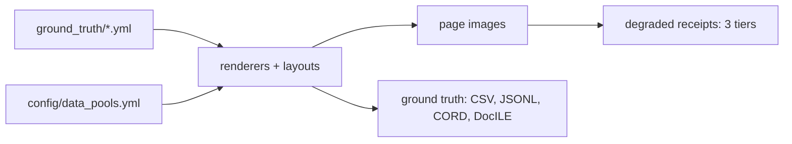

# Synthetic document generation — capability overview

A YAML-driven generator for Australian business documents with pixel-perfect ground
truth. Every value a model is scored against is authored rather than annotated, so
the answer key is exact by construction.

The corpus is 165 documents — 55 cases, each holding a bank statement, a receipt and
an invoice — across 18 layouts (8 bank, 6 receipt, 4 invoice), plus 165 degraded
receipts at three photographic severity tiers. Ground truth exports to extraction
CSV/JSONL, CORD and DocILE.



## How entities are defined

Entities live at two levels. **Vocabularies** in `config/data_pools.yml` supply the
population a generated corpus draws from — 15 pools covering retailers, banks,
product and service catalogues, locations and payment terminals:

```yaml
retailers:
  - name: Bunnings Warehouse
    address: 123 Main St, Alexandria NSW 2015
    abn: 18 634 229 001
    category: hardware

product_catalog:
  - description: Milk 2L
    unit: ea
    price_low: 2.5
    price_high: 5.5
```

**Instances** live in `ground_truth/*.yml`, one entry per document, and are the source
of truth — hand-editable, and never regenerated behind the author:

```yaml
CASE001:
  layout: receipt_professional
  fields:
    DOCUMENT_TYPE: RECEIPT
    SUPPLIER_NAME: Capital Business Supplies
    BUSINESS_ABN: 79 104 332 181
    INVOICE_DATE: 07/09/2023
    LINE_ITEM_DESCRIPTIONS: Potting Mix 25L|Panadol 24pk|Wiper Blades Pair
    LINE_ITEM_PRICES: 9.30|7.77|43.29
    IS_GST_INCLUDED: true
    GST_AMOUNT: 19.72
    TOTAL_AMOUNT: 216.89
```

Editing either level changes the corpus without touching code. The constraint is the
*schema*, not the values: 20 fields exist, of which the extraction contract asks 14
for invoices and receipts and 5 for bank statements. An entity type that is not one
of those fields requires schema and renderer work.

Values are also constrained by rules the generator enforces: ABNs carry a real
checksum, GST is one eleventh of a GST-inclusive total, and line-item lists must be
of equal length. Those rules make the corpus internally consistent, and they are what
a new entity type has to be expressed in terms of.

## How relationships are defined

A relationship is a declared link between two documents, carrying both the evidence
that connects them and a judgement about how hard it is to find.
`transaction_links.yml` holds 110 of them, matching a receipt or invoice to the
transaction row on a bank statement:

```yaml
CASE001_receipt_professional.png:
  - bank_statement: CASE001_cba_standard.png
    supplier: Capital Business Supplies
    receipt_date: 07/09/2023
    receipt_total: '216.89'
    bank_date: 07/09/2023
    bank_description: VISA DEBIT PURCHASE SQ *CAPITAL Alexandria AU
    bank_amount: '216.89'
    match_status: FOUND
    match_difficulty: medium
    notes: Early row on cba standard — exact date and amount, abbreviated merchant reference
```

Three parts do the work. The **endpoints** name both documents by filename. The
**evidence** repeats the fields that have to agree for the match to hold — date,
amount, supplier against the bank's abbreviated description. The **grading**
(`match_difficulty`, with a written `notes` rationale) records why the case is easy,
medium or hard, so a model's failures can be attributed to difficulty rather than to
chance. The current spread is 52 easy, 36 medium, 22 hard.

A new relationship type follows the same shape: a YAML file of graded links, and a
module that validates them against the documents they claim to connect.

## Known limits

Every link carries `match_status: FOUND`. There are no decoys, so the corpus measures
recall on relationship extraction but cannot currently measure precision.

Events are not modelled. Dates exist — transaction dates, statement periods, invoice
dates — but there is no representation of an event with participants and an ordering.
That is design work rather than configuration.

## Cost of extension

| Ask | Cost |
|---|---|
| Different entity values, same fields | YAML edit |
| New layout for an existing document type | Layout YAML |
| New document type | Layout + renderer + schema entries |
| New relationship type | Links YAML + validation module |
| Event modelling | New design |

Adding a document family is a demonstrated path rather than a hypothesis: the
repository previously carried four trust tax document types and credit-card
statements, with compliance and discrepancy relationships across 50 cases. They were
built, then removed when scope narrowed, and the history remains a worked example.

## What a new use case has to specify

1. The entity types to extract, and which are fields on a page versus derived values.
2. The relationships, and whether negative cases are needed to measure precision.
3. What an event consists of — participants, ordering, and how it surfaces on a page.
4. Jurisdiction and document families.
