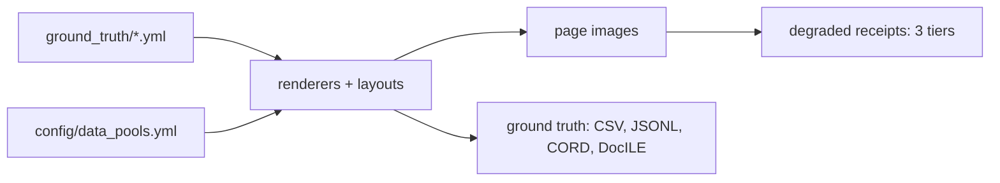

# Synthetic document generation — capability and extension guide

A YAML-driven generator for Australian business documents. Every value a model is
scored against is authored or generated rather than annotated: the string in the
answer key is the string drawn on the page, and per-field bounding boxes are recorded
by the renderer at draw time rather than estimated afterwards.

The corpus is 165 documents — 55 cases, each holding a bank statement, a receipt and
an invoice — across 18 layouts (8 bank, 6 receipt, 4 invoice), plus 165 degraded
receipts at three photographic severity tiers. Ground truth exports to extraction
CSV/JSONL, CORD and DocILE.



---

## 1. What runs today

Six commands take the corpus from nothing to a scored evaluation set. There is no
annotation step at any point: the label is the *input*, and the image is rendered
from it.

| Stage | Command | Produces |
|---|---|---|
| Content | `python scripts/seed_ground_truth.py` | 165 document entries with valid ABNs, correct GST arithmetic, matching line-item counts |
| Relationships | `python scripts/seed_transaction_links.py` | 110 graded links, each with a written rationale |
| Check | `python -m generators.pipeline validate` | Required fields, layout references, ABN checksums, date and amount formats — fail-fast |
| Render | `python -m generators.pipeline generate` | Page images plus per-field bounding boxes |
| Export | `python -m generators.pipeline derive` | CSV, JSONL, CORD, DocILE projections |
| Eval set | `python -m generators.pipeline eval-set --out <dir>` | Clean and degraded halves, each with its own ground truth |

Corpus size and composition are therefore free once a document family exists. The
cost sits in modelling the family once, not in producing instances of it.

`validate` enforces the invariants that a hand-edited entry can otherwise break
silently, because nothing downstream recomputes them: required fields, layout
references, ABN checksums, date and amount formats, equal item counts across parallel
pipe-delimited fields, and GST as one eleventh of a GST-inclusive total. Every rule is
declared in [`config/field_definitions.yml`](../config/field_definitions.yml) rather
than in Python, and a missing declaration fails loudly instead of quietly checking
nothing.

### A hurdle worth naming: the tests do not ship

The repository's regression net — 1,115 tests covering rendering determinism, export
fidelity, fit safety and schema rules — lives under `tests/`, which is **gitignored**.
A clone gets the pipeline and the validators but not the suite that pins their
behaviour.

That matters for anyone extending this. Pixel-level rendering is checked by snapshot
tests; export projections are checked by self-scoring tests that prove a CORD or
DocILE file scores 1.0 against itself. Change a renderer or an exporter without those,
and the failure is a subtly different image or a quietly wrong projection rather than
an exception. `validate` catches malformed *ground truth*; it does not catch a
regression in the *code*.

A team taking this on should plan either to receive the suite out of band or to write
their own around the parts they touch, and should treat the absence as a known gap
rather than discovering it after the first refactor.

---

## 2. How entities are defined

Entities exist at two levels.

**Vocabularies** in [`config/data_pools.yml`](../config/data_pools.yml) are 15 pools,
and they divide into two kinds that behave in opposite ways.

Most are **drawn from** — their contents appear on generated pages. All 41 distinct
receipt line items come from `product_catalog`, and all four bank names from `banks`:

```yaml
product_catalog:
  - description: Milk 2L
    unit: ea
    price_low: 2.5
    price_high: 5.5

banks:
  - code: cba
    name: Commonwealth Bank
    bsb_prefix: '06'
```

Three are **never drawn from**. `retailers`, `professional_services` and
`real_name_blocklist_extra` hold 41 real Australian businesses — 20 retailers,
5 professional services and 16 extras such as Aldi, Telstra and Origin Energy — and
[`content_engine.py`](../generators/content_engine.py) reads only their `name` fields
to build a blocklist. `fictional_business_name()` invents a name, screens it against
that list, and fails loudly rather than emitting a real company:

```yaml
retailers:            # a blocklist, NOT a source of supplier names
  - name: Bunnings Warehouse
    address: 123 Main St, Alexandria NSW 2015
    abn: 18 634 229 001
    category: hardware
```

The distinction is load-bearing: putting a real company on a fabricated invoice with a
fabricated ABN and a fabricated amount is a liability, so the real names exist
precisely to be avoided. None of the 165 ground-truth supplier names is a real
business.

**Instances** in [`ground_truth/*.yml`](../ground_truth/) are one entry per document, and are the source
of truth — hand-editable, and never regenerated behind the author:

```yaml
CASE001:
  layout: receipt_professional
  fields:
    DOCUMENT_TYPE: RECEIPT
    SUPPLIER_NAME: Capital Business Supplies
    BUSINESS_ABN: 79 104 332 181
    INVOICE_DATE: 07/09/2023
    LINE_ITEM_DESCRIPTIONS: Potting Mix 25L|Panadol 24pk|Wiper Blades Pair
    LINE_ITEM_PRICES: 9.30|7.77|43.29
    IS_GST_INCLUDED: true
    GST_AMOUNT: 19.72
    TOTAL_AMOUNT: 216.89
```

Editing either level changes the corpus without touching code. The constraint is the
*schema*, not the values: 20 fields exist, of which the extraction contract asks 14
for invoices and receipts and 5 for bank statements.

### Where Faker fits, and where it does not

[`generators/content_engine.py`](../generators/content_engine.py) (265 lines) owns one seeded `Faker("en_AU")` instance,
configured in `data_pools.yml` as `locale: en_AU`, `seed_base: 42`. It is used for
exactly two things: **person names** and **street addresses**.

Everything else comes from curated pools or from generation rules. Line items and
bank names are drawn from pools because they have to be plausible Australian
specifics that a name generator cannot invent; supplier names are composed from name
parts and screened, because they have to be plausible *and* certainly fictional.

Two properties of the engine matter for anyone extending it:

- **Invented businesses are screened.** `fictional_business()` composes AU entities
  from name parts and checks them against a real-name blocklist, so the generator
  cannot accidentally mint a real company.
- **Every primitive takes an injected `random.Random`**, and Faker is reseeded from
  that stream per call. A reseed is therefore reproducible *and diffable* run to run,
  which is why `faker==40.8.0` is pinned — an upgrade would silently change content.

That injection is visible in every signature the engine exposes:

```python
class ContentEngine:
    def person(self, rng: random.Random) -> dict: ...
    def address(self, rng: random.Random) -> str: ...
    def fictional_business(self, rng: random.Random, category: str) -> dict: ...

def sample(rng: random.Random, pool: list): ...
```

No primitive reaches for module-level randomness, so a caller controls the whole
stream and the corpus is a pure function of its seed.

### Rules the generator enforces

Values are constrained by invariants, not merely typed: ABNs carry a real checksum,
GST is one eleventh of a GST-inclusive total, and parallel line-item lists must be of
equal length. These make the corpus internally consistent, and a new entity type has
to be expressible in terms of rules of this kind.

---

## 3. How relationships are defined

A relationship is a declared link between two documents, carrying both the evidence
that connects them and a judgement about how hard it is to find.
[`transaction_links.yml`](../ground_truth/transaction_links.yml) holds 110, matching a receipt or invoice to a transaction row
on a bank statement:

```yaml
CASE001_receipt_professional.png:
  - bank_statement: CASE001_cba_standard.png
    supplier: Capital Business Supplies
    receipt_date: 07/09/2023
    receipt_total: '216.89'
    bank_date: 07/09/2023
    bank_description: VISA DEBIT PURCHASE SQ *CAPITAL Alexandria AU
    bank_amount: '216.89'
    match_status: FOUND
    match_difficulty: medium
    notes: Early row on cba standard — exact date and amount, abbreviated merchant reference
```

Three parts do the work. The **endpoints** name both documents by filename. The
**evidence** repeats the fields that must agree — date, amount, and supplier against
the bank's abbreviated description. The **grading** records why the case is easy,
medium or hard, with a written rationale. The current spread is 52 easy, 36 medium,
22 hard.

### Difficulty is manufactured, not observed

This is the part most worth understanding. [`scripts/seed_transaction_links.py`](../scripts/seed_transaction_links.py) does
not grade links after the fact. It *constructs* a link at a chosen difficulty by
controlling one variable — how recognisable the merchant string is on the bank
statement:

| Difficulty | Bank description characteristic |
|---|---|
| easy | exact date and amount, full merchant name |
| medium | exact date and amount, abbreviated merchant reference |
| hard | further degraded merchant reference |

Date and amount always match exactly, so difficulty is carried by that single axis,
and the `notes` rationale is generated from the same decision. The consequence is
that the difficulty distribution is a **dial**, not a property to be discovered — a
corpus can be commissioned as 80% hard if that is what a model needs to be stressed
on.

---

## 4. How pages are described: the layout DSL

A **domain-specific language** is a small notation built for one problem rather than
for general programming. The trade is deliberate: expressive power is given up in
return for something that can be validated up front and read by people who do not
write Python. This one is *declarative* — a layout states what a page contains, not
how to draw it — and *internal*, hosted in YAML rather than having a parser of its
own.

So a layout is not code. It is a YAML document interpreted by a shared engine in
[`generators/layout_dsl/`](../generators/layout_dsl/) — roughly 5,000 lines of
primitives that every document type reuses. This is why the per-type renderers are so
small: [`receipt.py`](../generators/receipt.py) is 69 lines and
[`invoice.py`](../generators/invoice.py) is 65, because they hand the layout to the
engine rather than drawing anything themselves.

A layout has two parts. **Page settings** — canvas width, margins, row height, font
sizes — and a **body**: an ordered list of elements, each a primitive with bindings
into the ground-truth entry. From
[`config/layouts/receipts.yml`](../config/layouts/receipts.yml):

```yaml
_receipt_body: &receipt_body
  - {type: text, content: "{SUPPLIER_NAME}", align: center, bold: true,
     budget: SUPPLIER_NAME, field: SUPPLIER_NAME}
  - {type: text, content: "ABN: {BUSINESS_ABN}", align: center,
     budget: ABN_LINE, field: BUSINESS_ABN, when: BUSINESS_ABN}
  - {type: spacer}
  - {type: rule}
  - type: split
    children:
      - [{type: pair, label: "Date", value: "{INVOICE_DATE}", field: INVOICE_DATE}]
      - [{type: text, content: "Time: {POS_TIME}", align: right}]
```

### The mental model: a list, a loop, and nine functions

A body is **a list**. The engine is **a loop**. Each primitive is **a function that
draws something and returns where the next thing starts**. From
[`generators/layout_dsl/engine.py`](../generators/layout_dsl/engine.py):

```python
Drawer = Callable[[dict, RenderContext, int], int]
#                  ↑block  ↑canvas+entry  ↑y-in  →y-out
```

Every primitive has that shape: give it the block's YAML dict, the render context and
the current vertical position; it draws, and returns the new vertical position. The
walker threading that cursor through is one function:

```python
def render_blocks(blocks: list, ctx: RenderContext, y: int) -> int: ...
```

A nine-entry dispatch table is the whole extension point.

| Group | Primitives | Role |
|---|---|---|
| Content | `text`, `pair`, `table`, `banner` | Draw something and consume vertical space |
| Whitespace | `rule`, `spacer` | Draw a line, or just advance the cursor |
| Containers | `split`, `block`, `panel` | Hold `children` and recurse; `split` places them side by side |

`table` is by far the heaviest at ~1,000 lines, because transaction and line-item
tables carry most of the extraction difficulty.

### The four bindings

Bindings are how an element reaches the ground-truth entry.
[`binding.py`](../generators/layout_dsl/binding.py) states its own constraint:

> Deliberately minimal: `{FIELD}` substitution and presence tests, nothing else. No
> expressions, no arithmetic, no filters — everything a layout references must be
> statically checkable before a single pixel is drawn.

| Binding | Effect |
|---|---|
| `{FIELD}` | Substituted from the entry; a `NOT_FOUND` value renders as empty string |
| `when:` | The loop **skips the block entirely** when that field is absent |
| `field:` | Declares which ground-truth field this element renders — drives box capture |
| `budget:` | Which pixel budget the text must fit; overflow raises rather than clips |

The whole binding surface is three functions and one regex — small enough to quote in
full, which is the point:

```python
_PLACEHOLDER = re.compile(r"\{([A-Z][A-Z0-9_]*)\}")

def referenced_fields(template: str) -> list[str]: ...   # what a layout asks for
def interpolate(template: str, fields: dict) -> str: ... # {FIELD} -> value
def is_present(fields: dict, field: str) -> bool: ...    # backs `when:`
```

`referenced_fields` is what makes startup validation possible: every `{FIELD}` in
every layout can be collected and checked against the schema before rendering begins.

### Tracing one block

Take the ABN line from the fragment above. The loop reaches it and, in order:

1. **`when: BUSINESS_ABN`** — is the field present? A receipt without an ABN skips the
   block and the cursor does not move, so there is no blank gap where it would have been.
2. **Dispatch** on `type: text` to `draw_text_block`.
3. **`content`** — `{BUSINESS_ABN}` is substituted, giving `ABN: 79 104 332 181`.
4. **`budget: ABN_LINE`** — the string is fitted to that pixel budget. Too long and it
   wraps or shrinks; genuinely impossible and it raises `FitError` rather than drawing
   something truncated.
5. **`field: BUSINESS_ABN`** — the `BoxRecorder` notes the rectangle just drawn under
   that field name. This is where `derived/geometry.jsonl` comes from: bounding-box
   ground truth is a by-product of the layout, not a separate labelling pass.
6. The drawer **returns the new y**, and the loop moves on.

Not every placeholder is ground truth. `{POS_TIME}`, `{POS_REGISTER}`, `{POS_STAFF}`
and `{RECEIPT_NUMBER}` are produced at render time by
[field providers](../generators/layout_dsl/field_providers.py) — they make a receipt
look like a receipt without being part of what a model is scored on.

"Interpreter" is the precise word: nothing generates code or translates the YAML into
Python. The engine reads the data structure and executes it directly, block by block,
the same relationship a JSON parser has to JSON. Two consequences follow. Errors are
tagged with the block's path as they unwind, so a failure reports
`layout_id.body[3].children[1]` rather than merely naming the layout. And because a
binding cannot express anything — no arithmetic, no conditionals beyond presence —
every field a layout references is checkable at startup, which is exactly the property
Jinja2 would have destroyed.

YAML anchors (`&receipt_body`, reused with `*receipt_body`) let layouts share bodies
and vary only in page settings — which is how 18 layouts exist without 18 independent
descriptions.

The practical consequence for extension: **a new layout is configuration, and a new
document type is mostly configuration plus a thin renderer.** The engine, the fit
safety, and the bounding-box capture come for free.

### Why a DSL, and why this one

The DSL replaced hand-written renderers, and the case for it was measured rather than
asserted ([`docs/layout_dsl_design.md`](layout_dsl_design.md)):

- **Duplication.** 2,283 lines across 8 layout files, most of it copy-paste — the four
  invoice layouts shared a single distinct `field_budgets` block and differed only in
  their sections. Today it is 1,352 lines across 3 files, though that is not a
  like-for-like comparison: the corpus also narrowed from eight document types to
  three in the same work, so anchoring accounts for some of the reduction and deletion
  for the rest.
- **Renderers that could not be extended.** `bank_statement.py` was 962 lines: four
  hardcoded per-bank functions selected by a `layout['renderer']` flag, with about ten
  booleans toggling blocks inside them. It is now **93 lines**, and all three renderers
  together come to 227.
- **A vocabulary that could not describe new documents.** The older section types were
  *semantic* — `seller_details`, `letterhead`, `receipt_meta`. A semantic vocabulary
  cannot express a document type it was not written for, so every new type required new
  Python. The current primitives are *structural* — `text`, `pair`, `table`, `split`,
  `rule`, `spacer` — and describe any document that is text in boxes.
- **Silent drift between Python and YAML.** Transaction-column budget widths were
  hand-computed in YAML to match x-offsets that lived in Python, and nothing checked
  they still agreed. Binding both to one declaration removes the class of bug.

Two alternatives were considered and rejected, and the reasons matter for anyone
tempted to revisit them:

- **HTML/CSS rendering** would forfeit three things this corpus depends on: the
  draw-time bounding boxes, the pinned Pillow font metrics that keep renders identical
  across machines, and deployability on a host with no public package mirror.
- **Jinja2 templating of the layout spec** was rejected because control flow in a
  template is not schema-validatable. It would move failures from startup to render
  time, which is precisely the fail-fast guarantee the rest of the configuration is
  built on.

The trade accepted in exchange is a larger engine — about 5,000 lines of primitives —
carried once, so that each document type costs a YAML file and roughly 70 lines.

---

## 5. Generated versus hand-authored

| Artefact | Origin | Size |
|---|---|---|
| Document content (165 entries) | Generated, seeded | — |
| Relationship links (110) | Generated, seeded, graded | — |
| Page images, bounding boxes | Rendered | — |
| Export projections | Derived | — |
| Layout specs | Hand-authored, declarative | 18 layouts |
| Entity vocabularies | Hand-curated | 15 pools |
| Renderer per document type | Code | 65–70 lines each |
| Shared layout engine | Code, reused by all types | ~5,000 lines |

The renderers are small — `receipt.py` is 69 lines, `invoice.py` 65 — because the
layout DSL carries the work. A new document type inherits that engine rather than
reimplementing it.

---

## 6. Scoring against public benchmarks: why CORD and DocILE

A score is only useful if it can be situated. Scored with a bespoke scorer on a
bespoke corpus, a result says "0.93 on our data by our method" — a number nobody
outside the project can interpret. The export layer re-projects the same ground truth
onto recognised document-AI schemas so a model can be scored with **published
evaluators**, and the figure compares to public work.

Both CORD and DocILE are emitted because they catch different failures. CORD asks
whether the model *read* a field; DocILE asks whether it *found* it. A model can
extract a total correctly with no idea where it sat on the page, and only the
localisation score catches that — which is where the geometry captured at draw time
earns its keep, since the `field:` bindings in a layout are what make the DocILE
projection possible at all.

**The decision worth understanding** is why the CORD number is trustworthy. CORD is
receipt-body-centric and has no labelled slot for supplier, ABN, address or date.
Those go in an `extension` subtree, scored *separately* rather than inside the tree —
because extra nodes no public CORD prediction can contain would depress the tree-edit
distance and destroy the comparability the export exists to buy. The result is two
figures instead of one compromised figure: one comparable to published results, one
complete over the fields actually extracted.

**Fidelity is proven, not assumed.** 144 exporter tests include self-scoring ones: a
generated CORD or DocILE file scored against itself must come out at exactly 1.0.
That is what separates a projection that is *faithful* from one that is merely
well-formed — a subtly wrong field map still produces valid JSON.

The specifics live elsewhere and are not repeated here: which target covers which
documents, the export-policy keys, and the licensing of the vendored evaluator are in
the README's [Benchmark Export Schemas](../README.md#benchmark-export-schemas)
section; the authoritative field maps are in
[`docs/GroundTruth_Export_Spec.md`](GroundTruth_Export_Spec.md).

---

## 7. Extending to a new Entity–Relation–Event use case

### New entities

Three cases, in ascending cost:

1. **Different values, same fields** — edit `data_pools.yml` or the ground-truth
   entries. No code.
2. **A new field on an existing document type** — add it to
   [`config/field_definitions.yml`](../config/field_definitions.yml) (the generation contract) and
   [`config/extraction_schema.yml`](../config/extraction_schema.yml) (the extraction contract), then place it in the
   layout so it renders. The two contracts are deliberately separate: a field can be
   drawn on the page without being scored, or scored as `NOT_FOUND` without being
   drawn.
3. **A new document type** — seven registration points:
   - [`config/generation_config.yml`](../config/generation_config.yml) — a `document_types` entry
   - `config/layouts/<type>.yml` — the visual spec
   - `ground_truth/<type>.yml` — the entries
   - [`config/field_definitions.yml`](../config/field_definitions.yml) and [`config/extraction_schema.yml`](../config/extraction_schema.yml)
   - `generators/<type>.py` — the renderer
   - `_RENDERERS` in [`generators/pipeline.py`](../generators/pipeline.py) — one line

The renderer's contract is one signature, shared by all three today — see
[`receipt.py`](../generators/receipt.py), [`invoice.py`](../generators/invoice.py) and
[`bank_statement.py`](../generators/bank_statement.py):

```python
def render_<type>(entry: dict, layout: dict, *, geometry_out: dict | None = None) -> Image.Image: ...
```

`entry` is the ground-truth entry, `layout` the parsed YAML spec, and `geometry_out` is
populated in place when given — opting in is what produces the bounding boxes. A new
renderer resolves page settings, hands the body to the engine, and returns the image;
that is why they run to roughly 70 lines.

Two other contracts a new type meets, both already generic over document type:

```python
def validate_entry(case_id: str, entry: dict) -> list[str]: ...  # generators/schema.py
def degrade_receipt(image: Image.Image, tier: Tier, seed: int) -> Image.Image: ...
```

[`validate_entry`](../generators/schema.py) returns errors rather than raising, so one
run reports every problem in the corpus.
[`degrade_receipt`](../generators/degradation/__init__.py) is receipt-specific by
name and by design, and a new photographed type would add a sibling rather than
generalise it.

This is a demonstrated path rather than a hypothesis. The repository previously
carried four trust tax document types and credit-card statements, with compliance and
discrepancy relationships across 50 cases. They were built, then removed when scope
narrowed; the history remains a worked example of the full sequence.

### New relations

Follow the shape of [`transaction_links.yml`](../ground_truth/transaction_links.yml):

1. A seeding script that constructs links at chosen difficulties, in the way
   `seed_transaction_links.py` manipulates merchant recognisability. The equivalent
   axis for a new relation must be identified first — it is what makes difficulty
   controllable rather than accidental.
2. A YAML file of graded links with evidence and rationale.
3. A validation module. The existing one is small: [`linking/`](../linking/) totals 233 lines across
   a matcher and a validator.

### Events

Not modelled today, and the largest of the three. Dates exist — transaction dates,
statement periods, invoice dates — but there is no representation of an event with
participants and an ordering.

An event model would need, at minimum: a declaration of what an event is (participants,
type, time), how it is distributed across documents so that reconstructing it requires
reading more than one, and the difficulty axis that makes reconstruction gradeable.
The existing linking machinery is a two-document special case of this, so it is a
starting point rather than a blocker — but it is design work, not configuration.

### Effort summary

| Ask | Cost |
|---|---|
| Different entity values, same fields | YAML edit |
| New layout for an existing document type | Layout YAML |
| New field on an existing type | Two schema entries + layout placement |
| New document type | Layout + ~70-line renderer + 7 registration points |
| New relationship type | Seeding script + links YAML + ~230-line validator |
| Event modelling | New design |

---

## 8. Data privacy: realistic, but not real

**Nothing real goes in.** There is no source corpus. No real invoice, receipt or
statement is read, transformed, de-identified or sampled at any point — every
document is composed from vocabularies and rules. That is a categorically different
position from anonymised or de-identified real data, which carries re-identification
risk precisely because a real record sits underneath. Here there is no record
underneath to re-identify.

### What is fabricated

| On the page | How |
|---|---|
| Supplier and payer business names | Invented from name parts, then screened against a real-name blocklist. `fictional_business_name()` retries and **fails loudly** rather than emitting a blocked name |
| ABNs | Generated to satisfy the real ABN checksum. **0 of the 110 emitted ABNs** collide with the 19 real ABNs held in the pools |
| People, addresses | Faker `en_AU` names, with generated street numbers |
| Amounts, dates, line items, transactions | Generated from catalogues and rules |

Verified rather than assumed: **none of the 165 ground-truth supplier names is one of
the 41 real businesses** in the blocklist pools.

### Why a blocklist is needed at all

Business names are not drawn from a list — they are **composed**:

```
{surname | suburb_prefix} + {category_noun}
```

from 30 surnames, 15 suburb prefixes and 14 category noun-sets, giving roughly
**2,610 possible names**. Composition can land on a real trading name by accident.
"Alexandria Hardware" is fine; something colliding with a real chain is not.

The blocklist makes that impossible for the names it knows. Every candidate is
lowercased and checked before it is returned, with a 20-attempt retry budget and a
loud failure if it is exhausted — so the generator can refuse to produce a corpus, but
it cannot quietly emit a real business.

The 41 names are chosen for exactly this exposure: the chains, utilities and telcos a
composed name is most likely to collide with, which is why
`real_name_blocklist_extra` carries Aldi, IGA, Telstra, Optus, Origin Energy and AGL
alongside the retailers already in the pools.

### What is deliberately real, and why

Two things on a generated page are genuine, and both are design decisions rather than
oversights:

- **Four bank names** — Commonwealth Bank, Westpac, ANZ and NAB appear as the issuing
  institution on bank statements, because a statement that names no real bank does not
  look like a statement. These are institution brands, not customer data, and bank
  statements carry no ABN. This is a trademark consideration rather than a privacy one,
  and worth a decision if the corpus is ever distributed externally.
- **Suburbs and postcodes** — `Alexandria NSW 2015`, `Hawthorn East VIC 3123` and
  similar are real Australian locations, paired with fabricated street numbers and
  street names. A fabricated suburb would make an address obviously synthetic and
  would break any model reasoning about geography.

### Residual risks, stated plainly

- **ABNs are checksum-valid, not registry-checked.** The generator has no access to
  the ABR, so it cannot prove a generated ABN is unregistered. A collision with a real
  registered ABN is possible by chance.
- **Person names come from a name generator**, which draws on real name distributions.
  A generated name coinciding with a real individual is possible, and unavoidable for
  any plausible-looking name.
- **The blocklist covers the 41 names it knows about, matched exactly.** It is a
  lowercased exact-match set, so a near-miss is not caught: `Bunnings Warehouse` is
  blocked, a hypothetical `Bunnings Hardware` would not be. An invented name could
  still coincide with a real business absent from the list.

None of these involve processing personal data: no real person's information enters
the system, so a coincidental collision is a collision, not a disclosure. If external
distribution is planned, the ABN and bank-brand points are the two worth an explicit
decision.

---

## 9. Known limits

**No negative cases in relationships.** Every link carries `match_status: FOUND`, so
the corpus measures recall on relationship extraction but cannot currently measure
precision. Adding decoys means generating plausible near-matches that must *not* be
linked — tractable within the existing seeding approach, but not present today.

**No event model.** As above.

**Bounding boxes describe the clean page only.** `derived/geometry.jsonl` records each
field's box in normalised coordinates, captured at draw time — but the degradation
pipeline warps the page through a camera-scan homography and nothing transforms the
geometry with it, and `eval-set` emits no geometry at all. So the degraded half has
field-value ground truth but no box ground truth, and a clean-page box actively
misdescribes a warped image.

**Degradation covers receipts only**, because receipts are the document type people
photograph. Bank statements and invoices arrive as clean PDFs, so degrading them
models nothing.

---

## 10. What a new use case has to specify

1. The entity types to extract, and which are fields on a page versus derived values.
2. The relationships, the evidence that establishes each one, and the single axis
   along which difficulty should vary.
3. Whether negative cases are needed, to measure precision as well as recall.
4. What an event consists of — participants, ordering, and how it surfaces across
   documents.
5. Jurisdiction and document families, since validation rules such as the ABN
   checksum and the GST fraction are jurisdiction-specific.
