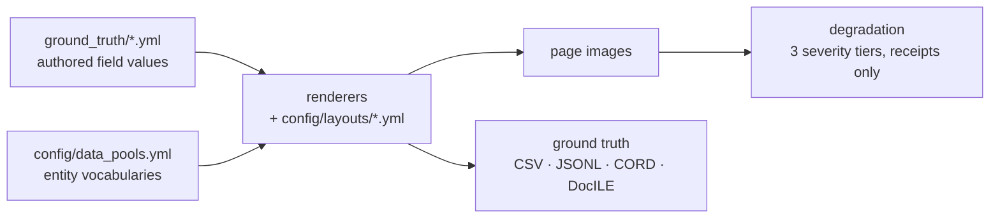

# Synthetic document generation — what it does, and how far it bends

A YAML-driven generator for Australian business documents with pixel-perfect ground
truth. Everything a model is scored against is authored, not inferred, so the answer
key is exact by construction rather than by annotation.

**Today's corpus:** 165 documents — 55 cases, each with a bank statement, a receipt
and an invoice — across 18 layouts (8 bank, 6 receipt, 4 invoice). Plus 165 degraded
receipts, the same 55 at three photographic severity tiers. Ground truth exports to
extraction CSV/JSONL, CORD and DocILE.

## Can it carry our entities, relationships and events?

**Entities — yes, largely without code.** `config/data_pools.yml` holds 15
vocabularies: retailers, banks, product and service catalogues, locations, payment
terminals. Swap a pool and the corpus changes. Individual documents are hand-editable
in `ground_truth/*.yml`, which is the source of truth and is never regenerated behind
you.

The limit is the *schema*, not the values: 20 fields, of which the extraction contract
asks 14 for invoices and receipts and 5 for bank statements. An entity that is not one
of those fields needs schema and renderer work.

**Relationships — one exists, and it is the template for more.**
`transaction_links.yml` carries 110 receipt/invoice → bank-statement links, graded
**52 easy / 36 medium / 22 hard**, each with a written rationale for its grade
("abbreviated merchant reference on an early row"). New relationship types follow the
same shape: declared in YAML with a difficulty grade, validated by a small module.

One caveat to know up front: every link is a true match. There are no decoys, so the
corpus measures recall on relationship extraction but cannot currently measure
precision.

**Events — not modelled.** Dates exist (transactions, statement periods, invoice
dates) but there is no notion of an event with participants and a timeline. This is
design work, not configuration.

## What each ask costs

| Ask | Cost |
|---|---|
| Different entity values, same fields | YAML edit |
| New layout for an existing document type | Layout YAML |
| New document type | Layout + renderer + schema entries |
| New relationship type | Links YAML + validation module |
| Event modelling | New design |

A new document family is a demonstrated path rather than a hypothesis: the repository
previously carried four trust tax document types and credit-card statements, with
compliance and discrepancy relationships across 50 cases. They were built, then
deliberately removed when scope narrowed — the history is a worked example.

## Two things to factor in early

**It is Australian by construction.** ABNs carry a real checksum, GST is one eleventh
of the total, amounts are AUD, retailers and banks are local. Another jurisdiction
means new pools and new validation rules — tractable, but not free.

**Degradation is receipts only**, because receipts are the document type people
photograph. Bank statements and invoices arrive as clean PDFs, so degrading them
models nothing.

## To scope your case, we would need

1. The entity types you extract, and which are fields on a document versus derived.
2. The relationships, and whether you need negative cases to measure precision.
3. What "event" means for you — participants, ordering, and how it surfaces on a page.
4. Jurisdiction and document families.
