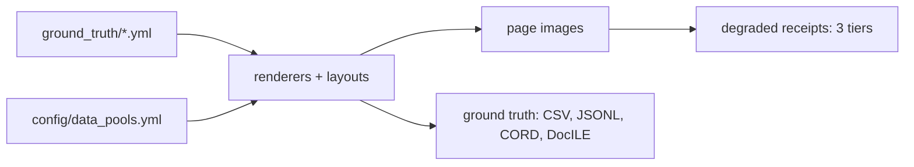

# Synthetic document generation — capability and extension guide

A YAML-driven generator for Australian business documents. Every value a model is
scored against is authored or generated rather than annotated: the string in the
answer key is the string drawn on the page, and per-field bounding boxes are recorded
by the renderer at draw time rather than estimated afterwards.

The corpus is 165 documents — 55 cases, each holding a bank statement, a receipt and
an invoice — across 18 layouts (8 bank, 6 receipt, 4 invoice), plus 165 degraded
receipts at three photographic severity tiers. Ground truth exports to extraction
CSV/JSONL, CORD and DocILE.



---

## 1. What runs today

Six commands take the corpus from nothing to a scored evaluation set. There is no
annotation step at any point: the label is the *input*, and the image is rendered
from it.

| Stage | Command | Produces |
|---|---|---|
| Content | `python scripts/seed_ground_truth.py` | 165 document entries with valid ABNs, correct GST arithmetic, matching line-item counts |
| Relationships | `python scripts/seed_transaction_links.py` | 110 graded links, each with a written rationale |
| Check | `python -m generators.pipeline validate` | Required fields, layout references, ABN checksums, date and amount formats — fail-fast |
| Render | `python -m generators.pipeline generate` | Page images plus per-field bounding boxes |
| Export | `python -m generators.pipeline derive` | CSV, JSONL, CORD, DocILE projections |
| Eval set | `python -m generators.pipeline eval-set --out <dir>` | Clean and degraded halves, each with its own ground truth |

Corpus size and composition are therefore free once a document family exists. The
cost sits in modelling the family once, not in producing instances of it.

**One caveat for anyone hand-authoring entries.** The seeder computes GST as
`total / 11` and keeps parallel line-item lists the same length, but `validate` does
not check either — it enforces ABN checksums, date and amount formats, and required
fields. Those two arithmetic invariants are asserted by the test suite, and `tests/`
is gitignored, so a fresh clone has no automated check for them. Hand-edited ground
truth can therefore carry a wrong GST amount or mismatched list lengths and still
validate, render and export.

---

## 2. How entities are defined

Entities exist at two levels.

**Vocabularies** in [`config/data_pools.yml`](../config/data_pools.yml) are 15 pools,
and they divide into two kinds that behave in opposite ways.

Most are **drawn from** — their contents appear on generated pages. All 41 distinct
receipt line items come from `product_catalog`, and all four bank names from `banks`:

```yaml
product_catalog:
  - description: Milk 2L
    unit: ea
    price_low: 2.5
    price_high: 5.5

banks:
  - code: cba
    name: Commonwealth Bank
    bsb_prefix: '06'
```

Three are **never drawn from**. `retailers`, `professional_services` and
`real_name_blocklist_extra` hold 25 real Australian businesses, and
[`content_engine.py`](../generators/content_engine.py) reads only their `name` fields
to build a blocklist. `fictional_business_name()` invents a name, screens it against
that list, and fails loudly rather than emitting a real company:

```yaml
retailers:            # a blocklist, NOT a source of supplier names
  - name: Bunnings Warehouse
    address: 123 Main St, Alexandria NSW 2015
    abn: 18 634 229 001
    category: hardware
```

The distinction is load-bearing: putting a real company on a fabricated invoice with a
fabricated ABN and a fabricated amount is a liability, so the real names exist
precisely to be avoided. None of the 165 ground-truth supplier names is a real
business.

**Instances** in [`ground_truth/*.yml`](../ground_truth/) are one entry per document, and are the source
of truth — hand-editable, and never regenerated behind the author:

```yaml
CASE001:
  layout: receipt_professional
  fields:
    DOCUMENT_TYPE: RECEIPT
    SUPPLIER_NAME: Capital Business Supplies
    BUSINESS_ABN: 79 104 332 181
    INVOICE_DATE: 07/09/2023
    LINE_ITEM_DESCRIPTIONS: Potting Mix 25L|Panadol 24pk|Wiper Blades Pair
    LINE_ITEM_PRICES: 9.30|7.77|43.29
    IS_GST_INCLUDED: true
    GST_AMOUNT: 19.72
    TOTAL_AMOUNT: 216.89
```

Editing either level changes the corpus without touching code. The constraint is the
*schema*, not the values: 20 fields exist, of which the extraction contract asks 14
for invoices and receipts and 5 for bank statements.

### Where Faker fits, and where it does not

[`generators/content_engine.py`](../generators/content_engine.py) (265 lines) owns one seeded `Faker("en_AU")` instance,
configured in `data_pools.yml` as `locale: en_AU`, `seed_base: 42`. It is used for
exactly two things: **person names** and **street addresses**.

Everything else comes from curated pools or from generation rules. Line items and
bank names are drawn from pools because they have to be plausible Australian
specifics that a name generator cannot invent; supplier names are composed from name
parts and screened, because they have to be plausible *and* certainly fictional.

Two properties of the engine matter for anyone extending it:

- **Invented businesses are screened.** `fictional_business()` composes AU entities
  from name parts and checks them against a real-name blocklist, so the generator
  cannot accidentally mint a real company.
- **Every primitive takes an injected `random.Random`**, and Faker is reseeded from
  that stream per call. A reseed is therefore reproducible *and diffable* run to run,
  which is why `faker==40.8.0` is pinned — an upgrade would silently change content.

### Rules the generator enforces

Values are constrained by invariants, not merely typed: ABNs carry a real checksum,
GST is one eleventh of a GST-inclusive total, and parallel line-item lists must be of
equal length. These make the corpus internally consistent, and a new entity type has
to be expressible in terms of rules of this kind.

---

## 3. How relationships are defined

A relationship is a declared link between two documents, carrying both the evidence
that connects them and a judgement about how hard it is to find.
[`transaction_links.yml`](../ground_truth/transaction_links.yml) holds 110, matching a receipt or invoice to a transaction row
on a bank statement:

```yaml
CASE001_receipt_professional.png:
  - bank_statement: CASE001_cba_standard.png
    supplier: Capital Business Supplies
    receipt_date: 07/09/2023
    receipt_total: '216.89'
    bank_date: 07/09/2023
    bank_description: VISA DEBIT PURCHASE SQ *CAPITAL Alexandria AU
    bank_amount: '216.89'
    match_status: FOUND
    match_difficulty: medium
    notes: Early row on cba standard — exact date and amount, abbreviated merchant reference
```

Three parts do the work. The **endpoints** name both documents by filename. The
**evidence** repeats the fields that must agree — date, amount, and supplier against
the bank's abbreviated description. The **grading** records why the case is easy,
medium or hard, with a written rationale. The current spread is 52 easy, 36 medium,
22 hard.

### Difficulty is manufactured, not observed

This is the part most worth understanding. [`scripts/seed_transaction_links.py`](../scripts/seed_transaction_links.py) does
not grade links after the fact. It *constructs* a link at a chosen difficulty by
controlling one variable — how recognisable the merchant string is on the bank
statement:

| Difficulty | Bank description characteristic |
|---|---|
| easy | exact date and amount, full merchant name |
| medium | exact date and amount, abbreviated merchant reference |
| hard | further degraded merchant reference |

Date and amount always match exactly, so difficulty is carried by that single axis,
and the `notes` rationale is generated from the same decision. The consequence is
that the difficulty distribution is a **dial**, not a property to be discovered — a
corpus can be commissioned as 80% hard if that is what a model needs to be stressed
on.

---

## 4. How pages are described: the layout DSL

A layout is not code. It is a declarative YAML document interpreted by a shared
engine in [`generators/layout_dsl/`](../generators/layout_dsl/) — roughly 5,000 lines
of primitives that every document type reuses. This is why the per-type renderers are
so small: [`receipt.py`](../generators/receipt.py) is 69 lines and
[`invoice.py`](../generators/invoice.py) is 65, because they hand the layout to the
engine rather than drawing anything themselves.

A layout has two parts. **Page settings** — canvas width, margins, row height, font
sizes — and a **body**: an ordered list of elements, each a primitive with bindings
into the ground-truth entry. From
[`config/layouts/receipts.yml`](../config/layouts/receipts.yml):

```yaml
_receipt_body: &receipt_body
  - {type: text, content: "{SUPPLIER_NAME}", align: center, bold: true,
     budget: SUPPLIER_NAME, field: SUPPLIER_NAME}
  - {type: text, content: "ABN: {BUSINESS_ABN}", align: center,
     budget: ABN_LINE, field: BUSINESS_ABN, when: BUSINESS_ABN}
  - {type: spacer}
  - {type: rule}
  - type: split
    children:
      - [{type: pair, label: "Date", value: "{INVOICE_DATE}", field: INVOICE_DATE}]
      - [{type: text, content: "Time: {POS_TIME}", align: right}]
```

Five things in that fragment are worth naming, because they are the vocabulary a new
document type is written in:

- **`type`** — the primitive: `text`, `pair` (label/value), `rule`, `spacer`, `split`
  (side-by-side columns), `table`. Tables are the heaviest, at ~1,000 lines of engine,
  because transaction and line-item tables carry most of the extraction difficulty.
- **`{FIELD}` interpolation** — `"{SUPPLIER_NAME}"` pulls from the ground-truth entry,
  so a scored field cannot disagree with the answer key. Not every placeholder is
  ground truth, though: `{POS_TIME}`, `{POS_REGISTER}`, `{POS_STAFF}` and
  `{RECEIPT_NUMBER}` are produced at render time by
  [field providers](../generators/layout_dsl/field_providers.py). They make a receipt
  look like a receipt without being part of what a model is scored on.
- **`field:`** — declares which ground-truth field this element renders. That binding
  is what produces `derived/geometry.jsonl`, the per-field bounding boxes captured at
  draw time and consumed by the DocILE export. Bounding-box ground truth is a
  by-product of the layout, not a separate labelling pass.
- **`when:`** — conditional rendering, so a field absent from an entry simply does not
  draw.
- **`budget:`** — a fit-safety constraint. Text that would overflow its budget raises
  rather than silently clipping, which is what keeps a rendered page faithful to the
  ground truth it claims to depict.

YAML anchors (`&receipt_body`, reused with `*receipt_body`) let layouts share bodies
and vary only in page settings — which is how 18 layouts exist without 18 independent
descriptions.

The practical consequence for extension: **a new layout is configuration, and a new
document type is mostly configuration plus a thin renderer.** The engine, the fit
safety, and the bounding-box capture come for free.

---

## 5. Generated versus hand-authored

| Artefact | Origin | Size |
|---|---|---|
| Document content (165 entries) | Generated, seeded | — |
| Relationship links (110) | Generated, seeded, graded | — |
| Page images, bounding boxes | Rendered | — |
| Export projections | Derived | — |
| Layout specs | Hand-authored, declarative | 18 layouts |
| Entity vocabularies | Hand-curated | 15 pools |
| Renderer per document type | Code | 65–70 lines each |
| Shared layout engine | Code, reused by all types | ~5,000 lines |

The renderers are small — `receipt.py` is 69 lines, `invoice.py` 65 — because the
layout DSL carries the work. A new document type inherits that engine rather than
reimplementing it.

---

## 6. Extending to a new Entity–Relation–Event use case

### New entities

Three cases, in ascending cost:

1. **Different values, same fields** — edit `data_pools.yml` or the ground-truth
   entries. No code.
2. **A new field on an existing document type** — add it to
   [`config/field_definitions.yml`](../config/field_definitions.yml) (the generation contract) and
   [`config/extraction_schema.yml`](../config/extraction_schema.yml) (the extraction contract), then place it in the
   layout so it renders. The two contracts are deliberately separate: a field can be
   drawn on the page without being scored, or scored as `NOT_FOUND` without being
   drawn.
3. **A new document type** — seven registration points:
   - [`config/generation_config.yml`](../config/generation_config.yml) — a `document_types` entry
   - `config/layouts/<type>.yml` — the visual spec
   - `ground_truth/<type>.yml` — the entries
   - [`config/field_definitions.yml`](../config/field_definitions.yml) and [`config/extraction_schema.yml`](../config/extraction_schema.yml)
   - `generators/<type>.py` — the renderer
   - `_RENDERERS` in [`generators/pipeline.py`](../generators/pipeline.py) — one line

This is a demonstrated path rather than a hypothesis. The repository previously
carried four trust tax document types and credit-card statements, with compliance and
discrepancy relationships across 50 cases. They were built, then removed when scope
narrowed; the history remains a worked example of the full sequence.

### New relations

Follow the shape of [`transaction_links.yml`](../ground_truth/transaction_links.yml):

1. A seeding script that constructs links at chosen difficulties, in the way
   `seed_transaction_links.py` manipulates merchant recognisability. The equivalent
   axis for a new relation must be identified first — it is what makes difficulty
   controllable rather than accidental.
2. A YAML file of graded links with evidence and rationale.
3. A validation module. The existing one is small: [`linking/`](../linking/) totals 233 lines across
   a matcher and a validator.

### Events

Not modelled today, and the largest of the three. Dates exist — transaction dates,
statement periods, invoice dates — but there is no representation of an event with
participants and an ordering.

An event model would need, at minimum: a declaration of what an event is (participants,
type, time), how it is distributed across documents so that reconstructing it requires
reading more than one, and the difficulty axis that makes reconstruction gradeable.
The existing linking machinery is a two-document special case of this, so it is a
starting point rather than a blocker — but it is design work, not configuration.

### Effort summary

| Ask | Cost |
|---|---|
| Different entity values, same fields | YAML edit |
| New layout for an existing document type | Layout YAML |
| New field on an existing type | Two schema entries + layout placement |
| New document type | Layout + ~70-line renderer + 7 registration points |
| New relationship type | Seeding script + links YAML + ~230-line validator |
| Event modelling | New design |

---

## 7. Known limits

**No negative cases in relationships.** Every link carries `match_status: FOUND`, so
the corpus measures recall on relationship extraction but cannot currently measure
precision. Adding decoys means generating plausible near-matches that must *not* be
linked — tractable within the existing seeding approach, but not present today.

**No event model.** As above.

**Bounding boxes describe the clean page only.** `derived/geometry.jsonl` records each
field's box in normalised coordinates, captured at draw time — but the degradation
pipeline warps the page through a camera-scan homography and nothing transforms the
geometry with it, and `eval-set` emits no geometry at all. So the degraded half has
field-value ground truth but no box ground truth, and a clean-page box actively
misdescribes a warped image.

**Degradation covers receipts only**, because receipts are the document type people
photograph. Bank statements and invoices arrive as clean PDFs, so degrading them
models nothing.

---

## 8. What a new use case has to specify

1. The entity types to extract, and which are fields on a page versus derived values.
2. The relationships, the evidence that establishes each one, and the single axis
   along which difficulty should vary.
3. Whether negative cases are needed, to measure precision as well as recall.
4. What an event consists of — participants, ordering, and how it surfaces across
   documents.
5. Jurisdiction and document families, since validation rules such as the ABN
   checksum and the GST fraction are jurisdiction-specific.
