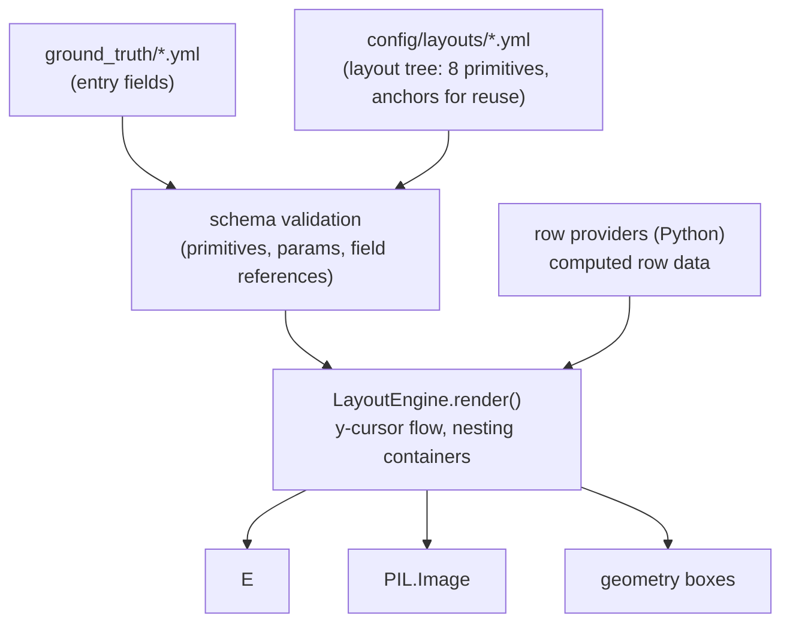

# Declarative Layout DSL — Design

Status: approved, pending implementation plan
Branch: `feat/declarative-layouts`

## Problem

Two complaints about the layout configuration, both real, measured below.

### Wart 1 — duplication

2,283 lines across 8 `config/layouts/*.yml` files, much of it copy-paste.

| File | Layouts | Distinct `field_budgets` blocks |
|---|---|---|
| `invoices.yml` | 4 | 1 — every key identical except `sections` |
| `bank_statements.yml` | 8 | 4 |
| `cc_statements.yml` | 8 | 4 |
| `receipts.yml` | 6 | 4 |
| `distribution_statements.yml` | 6 | 4 |
| 3 trust files | 1 each | 1 |

In `bank_statements.yml` the two layouts of a given bank differ only in `font_sizes`,
`row_height`, `date_format`, and one or two flags. Everything else is repeated verbatim.

### Wart 2 — only partly declarative

Six of eight renderers iterate a `sections:` list. The two that do not are
`bank_statement.py` (962 lines) and `cc_statement.py` (427 lines). Those two are
*flag-driven*: `layout['renderer']` selects one of four hardcoded per-bank functions
(`render_cba`, `render_westpac`, `render_nab`, `render_anz`), and roughly ten booleans
(`show_opening_balance`, `show_brought_forward`, `show_references`,
`include_rewards_points`, …) toggle blocks inside them.

Worse, the six renderers that *are* section-driven use **semantic** section types
(`seller_details`, `receipt_meta`, `letterhead`, `grid_section`) rather than structural
ones. A semantic vocabulary cannot express a document type it was not written for, so a
new document type always requires new Python.

Some content is hardcoded in Python where a layout cannot reach it:

- CBA's legal lines — `bank_statement.py:163`
- Westpac's rewards-panel figures — `bank_statement.py:399-407`
- Every bank's transaction column x-offsets — e.g. `bank_statement.py:192-196`

The last one causes silent drift: the `TRANSACTION_DESC` budget widths
(760 / 1064 / 860 / 780) are hand-computed to match column positions that live in Python.
Nothing checks that they still agree.

## Goals

1. A new document type is definable in YAML alone, without writing Python.
2. A new layout variant of an existing type is a YAML-only change.
3. Duplication across layout files is eliminated.
4. Configuration remains fully validated at startup, per CLAUDE.md's fail-fast rule.

## Non-goals

- HTML/CSS rendering. It would forfeit `derived/geometry.jsonl` bounding boxes, the
  Pillow 12.2.0 font-metric determinism pin, and PROD deployability (no public package
  mirror). Rejected.
- Jinja2 templating of the layout spec. Evaluated in detail and rejected as too high
  risk: control flow in templates is not schema-validatable, which would have required
  rewriting CLAUDE.md's fail-fast rule and would move failures to render time.
- Changing what the documents look like. Visual redesign is out of scope.
- Any change to `main`. Trust document types, credit-card statements, and transaction
  linking remain intact there.

## Scope decisions

### Corpus narrows to three document types

This branch generates `bank_statements`, `receipts`, and `invoices` only —
55 cases × 3 types × (clean + degraded) = **330 images**, down from 840.

This aligns the repo with what it already ships: `config/generation_config.yml:74-77`
already restricts the eval-set export to exactly these three types.

Deleted on this branch:

| Category | Items |
|---|---|
| Renderers | `cc_statement.py`, `trust_return.py`, `distribution_statement.py`, `trust_income_schedule.py`, `beneficiary_itr.py` |
| Layouts | the matching five `config/layouts/*.yml` |
| Ground truth | the matching five, plus `trust_distribution_links.yml`. **`transaction_links.yml` is retained** — see below |
| Linking | the trust-distribution half only. `linking/`, `generators/exporters/links.py` and the `doc_refs` output are **retained** for receipt↔bank linking |
| Scripts | `seed_trust_distribution_links.py`, `seed_trust_distributions.py`, `generate_trust_classification_gt.py`, `migrate_distribution_layouts.py`. **`seed_transaction_links.py` is retained** |
| Config | five `document_types` entries; the trust half of `field_definitions.yml` (46 columns → 23) |

Coupling was checked. References to cc/trust from surviving files are comments only
(`bank_statement.py:44`, `common.py:775`) or an error string (`exporters/native.py:57`).

### Receipt↔bank transaction linking is retained

**Reversed 2026-08-05 by the repo owner.** An earlier draft of this section had Stage 4
delete transaction linking entirely, on the grounds that a three-document-type corpus did
not need it. That is wrong and the decision is withdrawn.

`generators/payment_block.py` loads `ground_truth/transaction_links.yml` and forces each
receipt's card scheme from its linked bank transaction, so the receipt and the statement
agree on how the purchase was paid for. All 55 receipts are linked (verified: 55 entries,
55 index keys, zero unlinked). That agreement is the point of the pairing — a
transaction-linking benchmark is only scoreable if the two documents genuinely correspond,
and dropping it would have silently destroyed the property commits `b03401d`, `7621054`
and `200cfa7` were written to establish.

Retaining it means Stage 4 keeps `ground_truth/transaction_links.yml`,
`scripts/seed_transaction_links.py`, `load_link_index`, and the `doc_refs` derived output.
It also means **no receipt re-baseline is required on this account** — the card schemes
stay exactly as they are, because the mechanism that chooses them is unchanged.

### Output is re-baselined

Rendered output is not required to stay byte-identical. The corpus is regenerated and the
eval set re-exported as part of the work. Note that
`/Users/tod/Desktop/evaluation_data/synthetic_20260731/` is a pinned downstream dataset
that has been shared with the team; it must be re-exported and redistributed, not assumed
to still match.

## Architecture

### Two layers, cleanly separated



**YAML owns arrangement. Python owns drawing and computation.** The engine decides which
primitive runs with which parameters; it never encodes a pixel decision, and YAML never
encodes arithmetic.

### Primitive vocabulary

Eight structural primitives replace the ~30 semantic section types:

| Primitive | Purpose |
|---|---|
| `text` | one line of text; literal or field-bound |
| `pair` | label + value on one line |
| `block` | headed group of lines |
| `table` | repeating rows, declarative columns, row styles |
| `rule` | horizontal separator |
| `spacer` | vertical gap |
| `panel` | bordered container — **nests children** |
| `split` | side-by-side container dividing content width — **nests children** |

`panel` and `split` introduce nesting, which today's flat section list lacks. This is
the one architectural jump, and it is what lets an unseen document type compose rather
than require new Python.

The container is named `split` rather than `columns` deliberately, to avoid colliding
with the `table` primitive's `columns:` parameter.

Every text-bearing primitive takes an optional `role`, which selects a typographic style
from the layout's `font_sizes` and any associated weight/colour defaults — `header`,
`body`, `footer`, `fine_print`. `role` chooses a named style; it never carries pixel
values itself.

### Layout model

Vertical y-cursor flow, matching every existing renderer: each block consumes vertical
space and advances the cursor. Containers give their children a sub-region (narrowed
content width, offset origin) and advance the parent cursor by their total height.

No absolute positioning, no float, no automatic page breaking beyond what exists today.
This keeps `fit_text` budget application and `BoxRecorder` geometry capture working
unchanged.

### Data binding

Deliberately minimal, so everything stays statically checkable:

- `{FIELD}` interpolation inside `content`, `label`, and `value` strings.
- `when: <FIELD>` — render this block only if the field is present and not `NOT_FOUND`.
- `rows: <provider>` — bind a table to a row provider.

No expressions, no arithmetic, no comparisons, no filters in YAML.

### Row providers

Some table data is computed, not stored. The `Balance` column is produced by
`_compute_running_balances` (`bank_statement.py:99`), and the "Opening Balance" row is
derived by reversing the first transaction (`bank_statement.py:221-229`). Neither exists
in ground truth.

A **row provider** is a named Python function registered in the engine that turns an
entry into `list[dict]`. Tables reference one by name; columns reference keys of the
produced dicts.

```python
@row_provider("bank_transactions")
def bank_transactions(entry: dict) -> list[dict]:
    """date, description, debit, credit, balance per transaction."""
```

Two providers ship initially:

- `pipe_fields` — generic; zips pipe-delimited list fields into rows. A new document type
  whose tables are plain list fields needs **no Python**.
- `bank_transactions` — adds computed running balances and the optional opening row.

This is the design's one sanctioned escape hatch. It is a named, schema-validated
extension point rather than arbitrary logic in YAML: a provider name that is not
registered fails validation at startup with a full diagnostic.

### Worked example

```yaml
_bank_base: &bank_base
  page_dimensions: {width: 1800, height: 3508}
  content_width: 1600

_cba: &cba
  <<: *bank_base
  margin: 100
  field_budgets:
    TRANSACTION_DESC: {width: 760, fit: wrap, min_font: 10, max_lines: 2}
    SUPPLIER_NAME:    {width: 1600, fit: shrink, min_font: 12, max_lines: 1}

layouts:
  cba_standard:
    <<: *cba
    font_sizes: {header: 48, body: 32, footer: 18}
    row_height: 72
    body:
      - {type: text, content: "{SUPPLIER_NAME}", role: header, color: "#12107D"}
      - type: block
        role: fine_print
        lines:
          - Commonwealth Bank of Australia
          - ABN 48 123 456 789 AFSL and
          - Australian credit licence 234567
      - {type: pair, label: "Account Holder",   value: "{PAYER_NAME}"}
      - {type: pair, label: "Statement Period", value: "{STATEMENT_DATE_RANGE}",
         when: STATEMENT_DATE_RANGE}
      - {type: rule}
      - type: table
        rows: bank_transactions
        row_style: ruled
        opening_balance: true
        columns:
          - {key: date,        label: Date,        align: left,  x: 0}
          - {key: description, label: Description, align: left,  x: 200,
             budget: TRANSACTION_DESC}
          - {key: debit,       label: Withdrawal,  align: right, x_right: -420}
          - {key: credit,      label: Deposit,     align: right, x_right: -210}
          - {key: balance,     label: Balance,     align: right, x_right: 0}
      - {type: text, role: footer, content: "Transaction types: ..."}
```

`renderer:`, `variant:`, `column_headers:`, and every `show_*` flag disappear.

The guard against `table` accumulating a dozen orthogonal toggles is a rule about where
each of today's flags lands:

- A flag that controls a **whole block** and is constant for a document type becomes
  **presence or absence of that block** in `body:`. This covers `show_rewards_section`
  (a `panel`, Westpac premium only), `show_totals_row` (ANZ only), and
  `show_footer_transaction_types` (CBA only).
- A flag that inserts a **synthetic row inside a table** stays a table parameter, because
  it has no independent existence as a block. This covers `opening_balance` (CBA) and
  `brought_forward` (NAB, ANZ); both are emitted by the row provider under the
  parameter's control.
- A flag that genuinely **varies between layouts of the same document type** stays a
  table parameter. Only two do: `references` (`nab_classic` true, `nab_dense` false) and
  `date_grouping` (`westpac_premium` true, `westpac_standard` absent).

Row-level differences become a named `row_style` — `ruled` (CBA), `bordered` (Westpac
cell borders), `grouped` (NAB date grouping with sub-descriptions), `plain` (ANZ) —
rather than a set of booleans.

### De-duplication

Native YAML anchors and merge keys. PyYAML's `safe_load` expands `<<:` at parse time, so
every downstream consumer still receives a fully materialised dict and
`generators/layout_budgets.py` needs no change. CLAUDE.md's "every key required, no
silent defaults" rule stays literally true — the loaded layout carries every key
explicitly.

Expected: `bank_statements.yml` 209 → ~110 lines; `invoices.yml` sheds four identical
`field_budgets` blocks and six identical scalars; `receipts.yml` 195 → ~120.

## Validation and error handling

`pipeline validate` gains checks, and keeps every existing one. All failures use the
four-element diagnostic (what / where / expected / recover) required by CLAUDE.md.

1. **Primitive schema** — every block's `type` is known and its parameters are
   well-formed for that type.
2. **Field references** — every `{FIELD}`, `when:`, and column `key` resolves against
   `config/field_definitions.yml` or the declared row provider's output keys. An unknown
   field fails at startup.
3. **Row providers** — every `rows:` names a registered provider.
4. **Column geometry vs budgets** — a column's declared `budget` width must match the
   width implied by its `x` / `x_right` and the layout's `content_width`. This closes the
   silent-drift hole described under Wart 1. Mismatch fails at startup; the budget is
   **not** silently derived, so operator intent stays visible in the YAML.
5. **Nesting** — `panel` and `split` children must fit their parent's content width.
6. Existing fit-budget and overflow checks, unchanged.

## Geometry and fit safety

Unchanged in mechanism. `BoxRecorder` is threaded through the engine rather than through
each renderer, so any primitive bound to a field records its box. This makes geometry
capture more uniform than today, where only some draw calls are recorded.

`fit_text` and `field_budget()` are called by the engine at the same points the renderers
call them now. The Pillow 12.2.0 pin remains load-bearing and unchanged.

## Delivery stages

Each stage is independently revertible.

**Stage 1 — engine and schema, no pipeline changes.**
New `generators/layout_engine.py`, primitive schema, row-provider registry. Tested
standalone against hand-written specs. Nothing in the pipeline calls it yet.

**Stage 2 — migrate bank statements. This is the go/no-go.**
All 8 bank layouts expressed in the DSL; `bank_statement.py`'s four hardcoded renderers
deleted. Bank is the hardest case in the corpus — four row styles, a nested rewards
panel, computed balances — so an under-powered vocabulary surfaces here, with seven
renderers still on the old path.

*If the primitives cannot express all 8 bank layouts cleanly, stop and reconsider,
having spent one stage rather than the whole build.*

**Stage 3 — migrate receipts and invoices.**
Both already iterate sections; largely mechanical translation from semantic sections to
structural primitives.

**Stage 4 — narrow and re-baseline.**
Delete the old rendering path, the five out-of-scope document types, and linking.
Regenerate the corpus and re-export the eval set.

## Testing

`tests/` is gitignored and local-only. Per CLAUDE.md, every change ships with tests
passing and ≥80% coverage.

- **Engine unit tests** — one per primitive: geometry produced, cursor advanced, nesting
  regions correct, `when:` suppression, budget application.
- **Validation tests** — each of the six checks above fails on a malformed layout, with
  `assert_diagnostic_error` confirming all four diagnostic elements are present.
- **Row-provider tests** — `bank_transactions` running balances and opening row match the
  values `_compute_running_balances` produces today.
- **Migration equivalence (stage 2 and 3)** — for each layout, render old path and new
  path and assert the captured geometry boxes match within tolerance. Output need not be
  byte-identical, but fields must land in the same places. This is the main safety net
  and it retires with the old path in stage 4.
- **Existing suites** — `test_bank_fit.py`, `test_receipt_fit.py`, `test_invoice_fit.py`,
  `test_layout_budgets.py`, `test_geometry_capture.py`, `test_overflow_backstop.py` must
  keep passing throughout.

## Risks

| Risk | Mitigation |
|---|---|
| Vocabulary too weak for a future document type | Stage 2 tests it against the hardest existing case before the full build is committed |
| `table` accumulates orthogonal toggles into a god-block | Three-way rule for where each flag lands (block presence / synthetic-row parameter / within-type variation), applied in the worked example. Row variation uses named `row_style`, not booleans |
| Row providers become a dumping ground for logic | Providers return row data only; they cannot draw or position. New providers are Python changes subject to review, not a YAML escape hatch |
| Re-baselining invalidates the shared dataset | Explicit stage 4 deliverable: regenerate and re-export `synthetic_20260731`, then notify the team |
| Nesting introduces layout bugs the flat list never had | Engine unit tests cover container region arithmetic directly; validation check 5 rejects overflowing children at startup |

## Out of scope

- Restoring receipt↔bank payment consistency (deliberately dropped; see scope decisions).
- Any change to the degradation pipeline, exporters other than the removal of `doc_refs`,
  or the content engine.
- Migrating `main`'s trust and credit-card renderers to the DSL. If those types return
  later, they migrate then.
