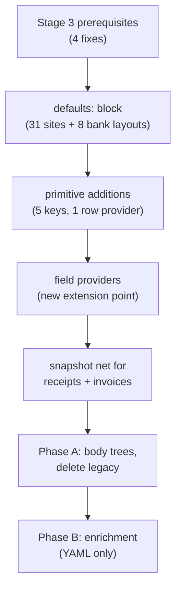

# Layout DSL Stage 3 — Receipts and Invoices Go Declarative

Status: approved, pending implementation plan
Branch: `feat/declarative-layouts`
Supersedes: the one-paragraph Stage 3 sketch in `docs/layout_dsl_design.md:326`
Prerequisite: `docs/layout_dsl_stage3_prerequisites.md`

## Problem

`docs/layout_dsl_design.md` predicts Stage 3 will be a "largely mechanical translation
from semantic sections to structural primitives", on the grounds that receipts and
invoices already iterate a `sections:` list. That prediction does not survive contact
with the two renderers.

### The YAML describes a document that is not drawn

`config/layouts/invoices.yml:65-93` declares a six-column line-item table — `#`,
`Description`, `Qty`, `Unit Price`, `Tax`, `Total` — with per-column pixel widths, per-column
font sizes, a `row_height`, and a `table_start_y: 1800`.

`generators/invoice.py:392-411` ignores every one of those keys. It draws four columns at
hardcoded offsets `margin`, `margin + 900`, `margin + 1050`, `margin + 1550`, with
`row_h = 52` and header strings written in Python.

The same inversion runs through both files. The operator-visible configuration is
decorative; the decisions live in Python.

### Roughly a fifth of each renderer is unreachable

Both renderers dispatch on `section.type`. The layout files emit only seven type values —
`header`, `separator`, `section`, `table`, `totals`, `label`, `footer` for invoices;
`header`, `separator`, `receipt_meta`, `itemized`, `totals`, `payment`, `footer` for
receipts. Every other branch is dead code:

| File | Unreachable branches | Lines |
|---|---|---|
| `generators/invoice.py` | `title`, `seller_details`, `invoice_metadata`, `buyer_details`, `line_items_table`, `line_items_table_taxable`, `line_items_table_gst_free` | 121-236, less the live `totals` branch — ~115 |
| `generators/receipt.py` | `title`, `metadata`, `gst_statement`, `total`, `content` | 240-258, 362-429 — ~87 |

### The layouts are near-identical

The six receipt layouts run the same eleven sections in the same order, differing only in
`width`, `margin`, `line_height`, `font_size`, and footer text. Their `header name:` values
— `merchant_header`, `fuel_station_header`, `business_header`, `restaurant_header` — are
read into `section.get("name")` and never used. All six render the same document.

The four invoice layouts differ only in that `tax_invoice_high_value` adds a
`delivery_details` section and `tax_invoice_mixed` splits the table in two.

### Pixel decisions and printed strings hardcoded in Python

- Invoice y-advances: 80, 48, 40, 64, 52, 44, 28, 20 (`invoice.py:124-461`)
- Invoice colours: `#F0F0F0` header fill, `#CCCCCC` borders, `gray` labels
- Invoice labels: `"Bill To:"`, `"Subtotal:"`, `"GST (10%):"`, `"GST included (10%):"`, `"Total:"`, and the four column headers
- Receipt labels: `"Date: "`, `"Time: "`, `"Reg: "`, `"Staff: "`, `"SUBTOTAL"`, `"GST"`, `"TOTAL"`
- Receipt POS pools: `_STAFF_NAMES` (`receipt.py:30-47`), the 08:00–19:59 hour window and the 01–08 register range (`receipt.py:104-111`)
- EFTPOS slip line order and labels: `"AID: "`, `"Card: "`, `"PSN: , ATC: "`, `"Purchase   AUD"`, `"Terminal ID: "`, `"Transaction Ref: "` (`payment_block.py:560-575`)
- Spacing idiom `line_h // 4`, repeated at seven sites across both files
- Canvas ceiling `max_h = 4000` (`receipt.py:151`)
- Fallback defaults on every layout read: `layout.get("width", 640)`, `("margin", 40)`, `("line_height", 36)`, `("font_size", 20)`, `("page_width", 2480)`, `("margin", 150)`

`payment_block.py` is the exception and the model to follow: its schemes, acquirers,
wallets, and printed labels already live in `config/data_pools.yml` under a
`payment_terminal` block with full four-element fail-fast validation
(`payment_block.py:68-210`). Only its *arrangement* is hardcoded.

### The engine itself carries 31 silent defaults

`generators/layout_dsl/` resolves absent block keys against Python literals:

| File | Sites |
|---|---|
| `primitives_text.py` | 14 — `role`→`body`, `color`→`black`, `align`→`left`, `bold`→`False`, `thickness`→`1`, `pad_above`/`pad_below`→`0`, `height`→`0`, `text_color`→`white`, banner `role`→`header` |
| `primitives_table.py` | 12 — `bold`→`False`, `fill_inset`→`0`, `group_gap`→`10`, `header_rule_top`→`True`, `header_rule_gap`→`16`, `dividers`→`[]`, `params`→`{}`, `header`→`True`, `offset_y`→`0`, `color`→`black`, `height`→`0`, `role`→`body` |
| `primitives_container.py` | 4 — `padding`→`0`, `border_color`→`black`, `gap`→`0`, `divider_color`→`black` |
| `providers.py` | 1 — `label`→`"Totals at end of period"` |

Each is a pixel decision Python makes when YAML is silent, which CLAUDE.md's
"every config key is required — never treat omitted keys as silent defaults" forbids.
`providers.py:362` is the worst of them: a string that is printed onto the page, living in
Python as a fallback.

## Goals

1. Receipts and invoices render entirely from `body:` trees in
   `config/layouts/receipts.yml` and `config/layouts/invoices.yml`.
2. No pixel value, colour, printed string, or spacing constant is decided by a Python
   literal. Reading the YAML alone answers "what is this configured to do?".
3. Rendered output is unchanged in Phase A, proven by pixel snapshot.
4. A new layout variant of either type is a YAML-only change, proven by Phase B.

## Non-goals

- Migrating the credit-card or trust renderers. They are out of scope on this branch
  (`docs/layout_dsl_design.md:71`).
- Stage 4's corpus narrowing, linking removal, and re-export. Separate stage.
- Restoring or removing receipt↔bank payment consistency. Phase A keeps today's
  behaviour; Stage 4 removes it as already decided (`docs/layout_dsl_design.md:93`).
- Visual redesign beyond what Phase B explicitly lists.

## Phasing

### Phase A — parity

`config/layouts/receipts.yml` and `invoices.yml` gain `body:` trees that reproduce today's
output. `generators/receipt.py` and `generators/invoice.py` shrink to page-setup adapters
matching `generators/bank_statement.py:39`. Dead code and dead keys are deleted.

Transaction linking stays wired: `receipt.py:339` passes
`load_link_index().get(f"{case_id}_{layout_id}")` into `derive_payment`, which fixes the
printed card scheme for linked receipts. Parity requires keeping it — dropping it changes
which scheme prints on 110 receipts.

**Phase A is done when the pixel snapshot for all 6 receipt and 4 invoice layouts is
byte-identical across the old and new paths.**

### Phase B — enrichment

YAML-only. No Python changes in this phase; that constraint is the point of it.

- Invoices gain the six-column table their YAML already describes, plus rendered payment
  terms, delivery details, and footer text.
- `tax_invoice_mixed` gains a genuine taxable / GST-free split.
- The six receipt layouts gain distinct headers matching their declared identity —
  merchant, fuel station, business, restaurant.

Phase B re-baselines both types and requires re-exporting
`/Users/tod/Desktop/evaluation_data/synthetic_20260731/`.

## Architecture

### Ordering



Each arrow is a commit boundary with tests passing.

### Prerequisites, first

The four items in `docs/layout_dsl_stage3_prerequisites.md` land before any body is
authored. They are inert against the 8 bank layouts and go live the moment a receipt or
invoice body exists:

1. Unbalanced-brace detection in `validate_body` — an unclosed `{FIELD` currently renders
   as a silent literal, and hand-authored bodies are where that typo happens.
2. `Region.divide`'s floor division (`context.py:72`). Receipt meta lines are two-column
   splits, so this goes live immediately.
3. `rule_above` drawing before `_validate_bold_spec` — statement order swap.
4. Four-element diagnostics on `Region.indent` and `Region.divide`.

### The `defaults:` block

Every layout gains a required `defaults:` mapping. Parameter resolution becomes
**block key → layout `defaults` → fail fast**, with no Python literal in the chain.

```yaml
layouts:
  receipt_thermal_80mm:
    defaults:
      role: body
      color: "#000000"
      align: left
      bold: false
      rule_thickness: 1
      rule_pad_above: 0
      rule_pad_below: 0
    body:
      - {type: text, content: "{SUPPLIER_NAME}", align: center, bold: true}
```

All 31 sites convert. All 8 bank layouts gain the block, seeded with exactly today's
Python literals so bank output does not move — `tests/test_bank_pixel_snapshot.py` is the
gate on that.

`defaults:` is shared through YAML anchors and merge keys, as the bank layouts already
share `field_budgets` (`docs/layout_dsl_design.md:271`). PyYAML expands `<<:` at parse
time, so every loaded layout still carries the block in full and "every key required"
stays literally true.

`validate_layout` gains a check that `defaults:` covers every parameter any primitive can
read, so an omission fails at startup with the four-element diagnostic rather than at the
first block that happens to need it.

`providers.py:362`'s `"Totals at end of period"` becomes a required param of the
`bank_transaction_totals` provider, declared in the bank layouts' `params:`.

### Primitive additions

| Need | Today | Addition |
|---|---|---|
| Label left, amount right — `draw_line_item` | `pair` draws `"{label}: {value}"` left-aligned (`primitives_text.py:147`) | `value_align: right` on `pair` |
| Dashed character separator — `draw_separator` (`common.py:540`) draws a row of `-` glyphs | `rule` draws a line | `fill_char` on `rule` |
| Invoice totals in a fixed 400px right column | `split` divides equally only (`context.py:55`) | `widths:` list on `split` |
| Inclusive-GST label yielding to a long amount (`invoice.py:283-285`) | measured in Python | `min_gap` on `pair` — YAML states the gap, Python measures |
| `tax_invoice_mixed` drawing the same items twice, capturing geometry only for the first (`invoice.py:412`) | `line_item_tables_seen` counter | `capture: false` on `table` |

Every addition is schema-validated and carries a `defaults:` entry.

One new row provider, `receipt_line_items`: `pipe_fields` plus the quantity prefix
(`"2x Coffee"` when quantity is not `1`, `receipt.py:265-268`). The prefix format string
is a provider param, not a Python literal.

### Field providers

A new extension point, symmetric to today's row providers. A registered function returns a
flat `dict[str, str]` merged into `entry["fields"]` before the body renders, so `{FIELD}`
interpolation (`binding.py:31`) and `when:` suppression (`engine.py:92`) work with no
engine change.

```python
@field_provider("receipt_pos", params=frozenset({"pools_key"}), emits=("POS_TIME", "POS_REGISTER", "POS_STAFF", "RECEIPT_NUMBER"))
def receipt_pos(entry: dict, params: dict) -> dict[str, str]:
    ...
```

`emits` is mandatory and declares the provider's output key names, so `validate` still
resolves every `{FIELD}` statically at startup — a placeholder naming neither a
`field_definitions.yml` column nor a declared emit fails before a pixel is drawn.

Three providers ship:

| Provider | Emits | Replaces |
|---|---|---|
| `receipt_pos` | `POS_TIME`, `POS_REGISTER`, `POS_STAFF`, `RECEIPT_NUMBER` | `receipt.py:70-120` |
| `receipt_payment` | the terminal-slip values — the fields of `PaymentDetails` (`payment_block.py:279`) less `purchase_total`, see below | wraps `derive_payment`; `render_payment_block` is deleted |
| `computed_totals` | `SUBTOTAL_AMOUNT` | `receipt.py:303`, `invoice.py:244` |

`receipt_payment` deliberately does **not** emit `purchase_total`. The slip's
`Purchase   AUD` line binds `{TOTAL_AMOUNT}` directly, so it cannot diverge from the
scored field — which is the invariant `payment_block.py:300-303` documents and currently
enforces by passing the same Decimal through.

A layout declares its providers explicitly:

```yaml
    field_providers:
      - {name: receipt_pos, params: {pools_key: pos_terminal}}
      - {name: receipt_payment, params: {pools_key: payment_terminal}}
      - {name: computed_totals, params: {}}
```

`pools_key` names a top-level block of `config/data_pools.yml`. `payment_terminal` exists
today; `pos_terminal` is new and holds the values listed under "Configuration moves to
YAML" below.

Emitted names are namespaced away from `config/field_definitions.yml`'s 23 scored columns.
A provider emitting a name that collides with a scored column fails validation — derived
presentation values must never be mistaken for extraction ground truth.

**The provider rule, inherited from Stage 2 and extended:** a provider may not emit a fact
that a `body:` tree can already state. `receipt_payment` emits *values*
(`"VISA CREDIT"`, `"xxxxxxxxxxxx3218"`); the slip's line order, labels, alignment, and
spacing are stated in the body.

### Configuration moves to YAML

Into `config/data_pools.yml` — a new `pos_terminal` block for the POS values, and the
existing `payment_terminal` block for the slip values — both subject to the same
four-element fail-fast validation `load_terminal_pools` already applies:

| Value | Destination | From |
|---|---|---|
| Staff-name pool (16 names) | `pos_terminal` | `receipt.py:30-47` |
| POS hour window `08`–`19` | `pos_terminal` | `receipt.py:104` |
| Register range `01`–`08` | `pos_terminal` | `receipt.py:108` |
| Receipt-number prefix `"R-"` and digest length `6` | `pos_terminal` | `receipt.py:81-82` |
| Slip line labels — `"AID: "`, `"Card: "`, `"PSN: , ATC: "`, `"Purchase   AUD"`, `"Terminal ID: "`, `"Transaction Ref: "` | `payment_terminal` | `payment_block.py:561-575` |
| Cash tender step `$5` and extra-note count `3` | `payment_terminal` | `payment_block.py:339-349`, `payment_block.py:404` |

Python keeps the SHA-256 arithmetic only. **The digest slicing must stay byte-identical** —
`receipt.py:100-113` consumes hex chars 0–8 and `payment_block.py:384` consumes 10–40, and
Phase A parity depends on both.

Into the layout files: every value currently defaulted by `layout.get(key, literal)`.
After Phase A no layout read carries a fallback; a missing key raises the four-element
diagnostic.

### Renderer adapters

`generators/receipt.py` and `generators/invoice.py` reduce to page setup, mirroring
`bank_statement.py:39-76`. `render_body` is canvas-agnostic — it takes a `Region` and a
y-cursor and returns the y below the last block (`engine.py:119`) — so receipts' variable
height needs no engine change:

1. Create a tall canvas from the layout's declared ceiling.
2. Call `render_body`.
3. Crop to the returned y plus the layout's bottom margin.
4. `rescale_vertical` the recorder's boxes, as `receipt.py:438` does today.

`generators/payment_block.py` keeps `load_terminal_pools`, `method_from_bank_description`,
`derive_payment`, and `PaymentDetails`. `render_payment_block` is deleted — the slip
becomes body blocks.

`load_link_index` stays until Stage 4.

## Validation

Additions to `python -m generators.pipeline validate`, all four-element diagnostics:

1. `defaults:` present and covering every parameter any primitive can read.
2. Every `field_providers:` entry names a registered provider, and its `params` match the
   provider's declared param keys.
3. Every `{FIELD}` and `when:` resolves to a `field_definitions.yml` column or a declared
   `emits` name.
4. No provider `emits` name collides with a scored column.
5. Unbalanced-brace detection in `validate_body` (prerequisite 1).
6. New primitive keys — `value_align`, `fill_char`, `widths`, `min_gap`, `capture` — are
   well-formed, and `widths` sums to the parent region minus gaps.

Every existing check keeps running.

## Testing

`tests/` is gitignored and local-only. Coverage stays ≥80%.

**The snapshot net is built before any body is authored.** `tests/regenerate_bank_pixel_snapshot.py`
generalises to cover receipts and invoices: per-layout render hashes plus geometry boxes
captured from the current renderers, then asserted against the DSL path. This is Phase A's
definition of done, and it retires when Phase B intentionally changes the pixels.

| Suite | Purpose |
|---|---|
| receipt + invoice pixel snapshot | Phase A parity gate — byte-identical across paths |
| `test_bank_pixel_snapshot.py` | unchanged output through the `defaults:` conversion |
| field-provider units | digest slices still produce today's values, per provider |
| `defaults:` resolution units | block key wins over defaults; a missing default fails fast |
| validation units | each of the six new checks, via `assert_diagnostic_error` |
| `test_receipt_fit.py`, `test_invoice_fit.py`, `test_payment_block.py`, `test_layout_budgets.py`, `test_geometry_capture.py`, `test_overflow_backstop.py` | green throughout |

## Risks

| Risk | Mitigation |
|---|---|
| The `defaults:` conversion silently shifts bank pixels | Bank snapshot already exists and must stay byte-identical; the conversion lands as its own commit ahead of any receipt or invoice work |
| Phase A parity unreachable for the measured inclusive-GST label | `min_gap` on `pair` reproduces `invoice.py:283-285` exactly. If it cannot, accept a documented sub-pixel delta rather than keep arithmetic in YAML |
| The primitive gap list, derived from reading, proves incomplete | Each addition is its own commit with tests, as the bank migration was. An unforeseen gap is one more commit, not a redesign |
| Field providers become a dumping ground | Same rule as row providers: a provider may not emit a fact a `body:` tree can already state. `emits` is declared and validated, so the surface is visible in review |
| A provider emit shadows a scored column and corrupts extraction ground truth | Validation check 4 rejects the collision at startup |
| `defaults:` becomes a second hiding place for pixel decisions | It is YAML, versioned and diffable; the rule it satisfies is visibility, not absence. A default that varies per block belongs on the block |

## Out of scope

- Credit-card and trust renderers.
- Stage 4: corpus narrowing to three types, linking removal, re-baseline, re-export.
- The degradation pipeline, the content engine, and every exporter.
