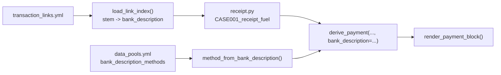

# Receipt / Bank Payment-Method Consistency — Design

**Date:** 2026-07-31
**Status:** Approved, ready for implementation planning
**Follows:** `docs/receipt_payment_block_design.md` (known follow-up recorded there)

## Problem

A receipt's payment method is derived from a hash of its case id, independently of the
bank-statement transaction it is linked to in `ground_truth/transaction_links.yml`. The two
therefore disagree.

Measured against the current corpus: all 55 receipts are linked, every linked bank row is a
card transaction (`VISA DEBIT` ×19, `EFTPOS` ×36, no cash rows), and **39 of 55 receipts
mismatch**:

| Count | Bank row says | Receipt prints |
| --- | --- | --- |
| 11 | EFTPOS | Mastercard |
| 8 | EFTPOS | Visa |
| 7 | VISA DEBIT | EFTPOS |
| 4 | VISA DEBIT | Mastercard |
| 3 | EFTPOS | Cash |
| 2 | VISA DEBIT | Cash |
| 2 | EFTPOS | AMEX |
| 1 | VISA DEBIT | AMEX |
| 1 | EFTPOS | Apple Pay |

Five of these are not merely inconsistent but impossible: a cash purchase never appears on a
bank statement. The rest print the wrong scheme.

A second, subtler mismatch: bank rows say `VISA DEBIT PURCHASE`, while the receipt's `Visa`
scheme prints `VISA CREDIT` with account type `CR`. Aligning the method alone would leave the
receipt claiming credit where the statement records debit.

This matters because transaction linking is a scored task: a model asked to match a receipt to
its bank row sees contradictory evidence on the two pages.

## Decisions

1. **The bank row is the source of truth.** Bank `TRANSACTION_DESCRIPTIONS` are scored ground
   truth; the receipt payment block is not. Deriving the receipt from the link changes nothing
   scored — no reseed, no bank or CC baseline re-capture. Only receipt renders change.
2. **No cash receipts.** Every receipt in this corpus has a `match_status: FOUND` bank link, so
   a consistent corpus has no cash. `Cash: 0` is set explicitly in YAML rather than deleting
   the key, so the intent is visible; restoring cash means adding unmatched receipts later.
3. **Debit schemes are added,** so a receipt linked to `VISA DEBIT PURCHASE` prints
   `VISA DEBIT`, not `VISA CREDIT`.
4. **Wallets are preserved by presentation.** With every receipt linked, forcing the scheme
   from the bank row would erase Apple/Google Pay from the corpus and leave the `CONTACTLESS`
   branch dead. A hash slice instead presents a card payment as a wallet *over the same
   scheme* — which is what physically happens when a phone is tapped, and keeps the bank row
   consistent.

## Configuration

Three additions to `payment_terminal:` in `config/data_pools.yml`.

```yaml
  # A linked receipt's scheme is fixed by its bank row, not by the weighted pool.
  # Longest matching prefix wins. `validate` fails if a linked description matches none.
  bank_description_methods:
    MASTERCARD DEBIT: Mastercard Debit
    VISA DEBIT: Visa Debit
    EFTPOS: EFTPOS

  # Two new entries alongside the existing EFTPOS / Visa / Mastercard / AMEX schemes.
  schemes:
    Visa Debit:
      display: VISA DEBIT
      aid: A0000000031010
      pan_digits: 16
      account_types: [CHQ, SAV]
    Mastercard Debit:
      display: MASTERCARD DEBIT
      aid: A0000000041010
      pan_digits: 16
      account_types: [CHQ, SAV]

  # A linked receipt's scheme is fixed; this decides how often that payment is
  # presented as a phone wallet over the same scheme.
  wallet_presentation_weights:
    none: 90
    Apple Pay: 6
    Google Pay: 4

  receipt_method_weights:
    Cash: 0        # every receipt in this corpus is linked to a bank transaction
```

`receipt_method_weights` now applies only to *unlinked* receipts, of which there are currently
none. It is retained as the documented fallback rather than deleted.

Setting `Cash: 0` requires relaxing the weight validator from "positive integer" to
"non-negative integer, with at least one positive weight". This is the project's stated way to
ship a no-op — an explicit value in YAML rather than a deletion.

## Architecture

`generators/payment_block.py` gains two functions and one parameter. `generators/receipt.py`
gains a single lookup. No new module: the link index is small and belongs with the payment
logic that consumes it.



| Symbol | Contract |
| --- | --- |
| `load_link_index(path=_LINKS_PATH) -> dict[str, str]` | Maps image stem (`"CASE001_receipt_fuel"`) to that link's `bank_description`. Receipt links only — invoice links are ignored, since invoices render no payment block. `lru_cache`d. Raises `FileNotFoundError` if the links file is absent. Where a stem carries several links, the first is used; the seed script emits one per receipt. |
| `method_from_bank_description(description, cfg) -> str` | Longest-prefix match over `bank_description_methods`, returning a `schemes` key. Raises `ValueError` with a four-element diagnostic naming the unmapped description. |
| `derive_payment(..., bank_description: str \| None = None)` | With a description, the scheme is forced from it and `wallet_presentation_weights` decides card vs wallet. With `None`, the existing weighted pick over `receipt_method_weights` is unchanged. |

When a wallet is presented, `PaymentDetails.method` is the wallet name (`"Apple Pay"`) and
`kind` is `"wallet"`, while `scheme_name` and `scheme_display` remain the scheme the bank row
dictates (`"Visa Debit"` / `VISA DEBIT`). The consistency invariant is therefore stated over
`scheme_name`, never over `method`.

The `none` key of `wallet_presentation_weights` is a sentinel meaning "present as a plain card
payment". Validation treats it as reserved: every *other* key must be a key of `wallets`, and
`none` is never resolved against `schemes` or `wallets`.

Every other derived value — masked PAN, PSN, ATC, terminal id, transaction ref, timestamp,
account type — stays hash-derived exactly as today, from the same digest slices.

Digest slices are unchanged except that chars 10:14, previously the method pick, now select
the wallet presentation when a bank description is supplied. Unlinked receipts still use
10:14 for the method pick, so their output is byte-identical to today's.

## Validation

`pipeline validate` gains a check over `ground_truth/transaction_links.yml`: every receipt
link's `bank_description` must resolve through `bank_description_methods`. Failures are
collected and reported together in one four-element diagnostic listing each offending stem and
description.

This is the guard that keeps the fix from silently rotting: a future reseed that introduces,
say, `AMEX PURCHASE ...` fails validation instead of quietly reintroducing mismatches.

## Testing

`tests/` is gitignored and local-only.

The invariant test is the proof of the fix — for all 55 linked receipts, the scheme the
receipt renders matches the scheme its bank row names. It fails 39 times before the change and
zero times after.

Additional tests:

- Longest-prefix matching: `MASTERCARD DEBIT` wins over a hypothetical `MASTERCARD` entry.
- An unmapped description raises a diagnostic carrying all four elements.
- A wallet presentation keeps the bank-dictated scheme: `scheme_name` still matches the
  mapping, `kind` is `wallet`, and the `CONTACTLESS` line names the wallet.
- Wallet presentation stays within its configured share across the corpus (at least one
  wallet, and wallets do not dominate).
- An unlinked receipt (a case id absent from the links file) falls back to the weighted pick
  and its `PaymentDetails` is byte-identical to today's.
- `Cash: 0` is accepted by the validator; all-zero weights are rejected with a diagnostic.
- `validate` passes on the shipped corpus.

Receipt render baselines in `tests/fixtures/receipt_baseline_hashes.json` are re-captured, as
every receipt render changes. The bank and CC baselines must not change — that is asserted by
the existing suites staying green without re-capture.

## Out of scope

- Introducing `match_status: NOT_FOUND` receipt links so cash receipts can exist. That changes
  the linking benchmark's 110-link, three-difficulty distribution and deserves its own design.
- Invoice payment presentation: invoices render no payment block.
- Any change to bank or CC statement rendering, ground truth, or exports.
