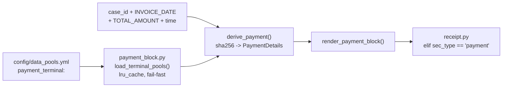

# Receipt Payment Block — Design

**Date:** 2026-07-31
**Status:** Approved, ready for implementation planning

## Problem

Synthetic receipts are unrealistic because they omit the EFTPOS terminal slip that real
Australian POS receipts always carry. Every receipt layout in `config/layouts/receipts.yml`
already declares a `payment` section, but `generators/receipt.py` renders it as a single bare
line (`EFTPOS`, `CASH`, …):

```python
elif sec_type == "payment":
    method = fields.get("PAYMENT_METHOD") or pos_details["payment_method"]
    draw.text((margin, y), method, font=font, fill="black")
    y += line_h
```

A real receipt prints a full terminal block — acquirer, card scheme, masked PAN, AID/PSN/ATC,
purchase amount, approval, terminal ID, transaction reference, timestamp, and a retain-copy
footer.

Two defects surfaced while scoping this work:

1. `_PAYMENT_METHODS` is a hardcoded Python list in `generators/receipt.py:48`, while
   `config/data_pools.yml` carries a `payment_methods:` pool the renderer ignores. This
   violates the YAML-is-single-source-of-truth rule.
2. The payment method is hash-derived independently of `ground_truth/transaction_links.yml`,
   so a receipt can render `CASH` while its linked bank row reads
   `VISA DEBIT PURCHASE …`.

## Scope

**In scope:** rendering realism only.

**Out of scope (explicit decisions, not oversights):**

- No new columns in `config/field_definitions.yml` — nothing in the payment block is scored.
- No ground-truth reseed; `ground_truth/receipts.yml` is untouched.
- No geometry capture for payment lines — `derived/geometry.jsonl` and the DocILE export are
  unaffected because no payment value is a scored field.
- Defect 2 above (payment-method ↔ `transaction_links.yml` consistency) is **not** fixed here.
  It is recorded as a known follow-up.

Defect 1 **is** fixed, because this work replaces the hardcoded list outright.

## Architecture

A new module, `generators/payment_block.py`, owns terminal-slip config, derivation, and
rendering. The `payment` branch in `generators/receipt.py` becomes a call into it.

Rationale: `generators/receipt.py` is 426 lines and its section loop is already a long
`if/elif` chain. Inlining roughly 90 lines of EFTPOS logic would deepen that. The new module
has one purpose, a two-function public interface, and no dependency on the receipt renderer.



### Public interface

| Symbol | Contract |
| --- | --- |
| `PaymentDetails` | Frozen dataclass: `method`, `kind` (`card`/`wallet`/`cash`), `acquirer`, `scheme_display`, `account_type`, `aid`, `masked_pan`, `psn`, `atc`, `terminal_id`, `transaction_ref`, `timestamp`, `wallet_label`, `tendered`, `change` |
| `derive_payment(case_id, invoice_date, total, time_str) -> PaymentDetails` | Pure; deterministic; no PIL dependency |
| `render_payment_block(draw, details, y, *, layout, layout_id, width, margin, line_h, font, font_bold, is_mono, font_size) -> int` | Draws the block, returns the new `y` |
| `load_terminal_pools() -> dict` | Loads and validates `payment_terminal` from `config/data_pools.yml`; `lru_cache`d |

`derive_payment` being PIL-free means the derivation half is unit-testable without rendering.

## Configuration

All constants live in `config/data_pools.yml` under a new `payment_terminal:` key, alongside
the existing Australian business pools.

```yaml
payment_terminal:
  receipt_method_weights:      # POS-plausible subset; excludes BPAY/PayPal/Bank Transfer
    EFTPOS: 30
    Visa: 25
    Mastercard: 20
    AMEX: 5
    Cash: 12
    Apple Pay: 5
    Google Pay: 3
  acquirers:
    - Tyro Payments EFTPOS
    - Westpac EFTPOS
    - CBA Smart EFTPOS
    - ANZ Worldline EFTPOS
    - Smartpay EFTPOS
    - NAB EFTPOS
  schemes:
    EFTPOS:     {display: eftpos,           aid: A0000003841001, pan_digits: 16, account_types: [SAV, CHQ]}
    Visa:       {display: VISA CREDIT,      aid: A0000000031010, pan_digits: 16, account_types: [CR]}
    Mastercard: {display: MASTERCARD,       aid: A0000000041010, pan_digits: 16, account_types: [CR]}
    AMEX:       {display: AMERICAN EXPRESS, aid: A00000002501,   pan_digits: 15, account_types: [CR]}
  wallets:
    Apple Pay: APPLE PAY
    Google Pay: GOOGLE PAY
  entry_modes:
    card: (c)
    wallet: (t)
  contactless_label: CONTACTLESS
  customer_copy_text: CUSTOMER COPY
  approved_text: APPROVED
  response_code: '00'
  retain_text: Retain copy for your records
  cash:
    tendered_label: CASH TENDERED
    change_label: CHANGE
```

`receipt_method_weights` replaces `_PAYMENT_METHODS` in `generators/receipt.py`, which is
deleted. The payment mix becomes operator-visible in YAML: reading the file alone answers
"what proportion of receipts are cash?".

Wallet payments (`Apple Pay`, `Google Pay`) resolve their scheme by hashing into
`schemes` — a wallet transaction still runs over a card scheme.

The existing top-level `payment_methods:` pool is left untouched; it serves other document
types. `payment_terminal.receipt_method_weights` is the receipt renderer's only source of
methods.

### Fail-fast validation

`load_terminal_pools()` validates every key above and raises on the first problem, with a
diagnostic carrying all four required elements (what, where, expected, recover) — matching the
shape of `generators/content_engine.py::_missing_key_error`. There are no Python-side defaults
for any key: a missing key is an error, never a silent fallback.

Validation covers: `payment_terminal` present and a mapping; each required sub-key present;
`acquirers` a non-empty list; `schemes` a non-empty mapping whose every entry has `display`,
`aid`, `pan_digits`, and a non-empty `account_types`; `entry_modes` carrying both `card` and
`wallet`; every key of `receipt_method_weights` resolvable to either a `schemes` entry, a
`wallets` entry, or the literal `Cash`; all weights positive integers.

Account type is per-scheme rather than global: EFTPOS draws `SAV`/`CHQ`, while credit schemes
render `CR`. A global list would let the renderer print `VISA CREDIT SAV`.

## Rendering

### Determinism

All values derive from the digest already computed in
`generators/receipt.py::_derive_receipt_details` — `sha256(f"{case_id}:pos:{invoice_date}")`.
That function currently consumes digest hex characters 0–10 (time, register, staff, method);
the payment block consumes characters 10–40 for acquirer index, account type, PAN last-4,
PSN, ATC, terminal ID, transaction reference, and cash tender note. The same case always renders the
same block.

The method itself is now drawn from `receipt_method_weights` — a weighted pick over the
expanded weight list, indexed by digest — replacing the uniform pick over `_PAYMENT_METHODS`.

### Block variants

**Card** (`EFTPOS`, `Visa`, `Mastercard`, `AMEX`):

```
        CUSTOMER COPY
     Tyro Payments EFTPOS

eftpos SAV
AID: A0000003841001
Card: xxxxxxxxxxxx3218 (c)
PSN: 00, ATC: 004E

Purchase   AUD      $137.73
APPROVED   00

Terminal ID: 3
Transaction Ref: 298656
07 Jul 2024 at 10:33 AM

Retain copy for your records
```

Line composition, stated exactly so the renderer has no room to invent:

- Scheme line: `{scheme.display} {account_type}` — e.g. `eftpos SAV`, `VISA CREDIT CR`.
- Card line: `Card: {masked_pan} {entry_mode}`, where `entry_mode` is `entry_modes.card`
  (`(c)`, chip) for card methods and `entry_modes.wallet` (`(t)`, contactless) for wallets.
- Masked PAN width follows `pan_digits`: 16-digit schemes render 12 `x` plus the last four,
  AMEX renders 11 `x` plus the last four.
- Timestamp: `{DD Mon YYYY} at {hh:mm AM/PM}` — the 12-hour rendering of the same 24-hour
  time the `receipt_meta` header prints as `Time: 13:33`, so `13:33` becomes `01:33 PM`.

**Wallet** (`Apple Pay`, `Google Pay`): identical, with `CONTACTLESS - APPLE PAY` inserted
after the acquirer line, and the wallet entry mode on the card line.

**Cash**: no terminal lines at all —

```
CASH TENDERED             $150.00
CHANGE                     $12.27
```

### Consistency with scored fields

Two rules keep the block from ever contradicting ground truth:

1. `Purchase AUD $x` renders `TOTAL_AMOUNT` verbatim, and the block timestamp is built from
   `INVOICE_DATE` plus the same `pos_details['time']` the `receipt_meta` header already
   prints. The block reinforces scored values rather than competing with them.
2. **No AU 5-cent cash-rounding line.** Real cash receipts print `ROUNDING -0.02`, but that
   implies a cash total differing from `TOTAL_AMOUNT`, which is scored. Tendered is the next
   round note above the total; change is tendered minus total, exactly. This trades a small
   amount of realism for ground-truth integrity, deliberately.

### Fit safety

Two budget keys — `PAYMENT_ACQUIRER` and `PAYMENT_LINE` (`fit: shrink`, `min_font: 8`) — are
added to all six layouts in `config/layouts/receipts.yml`. Payment lines render through the
`draw_fitted_*` helpers so the narrow 57mm layout cannot clip. The `sections:` lists are
otherwise unchanged: `- type: payment` already exists in all six layouts, and every layout
renders the full block.

Receipts grow by roughly 12 lines (~240px) — well inside the renderer's `max_h` of 4000, and
faithful to real thermal receipts.

## Testing

`tests/` is gitignored and local-only.

New `tests/test_payment_block.py`:

- Determinism: the same `(case_id, invoice_date)` yields an identical `PaymentDetails` across
  repeated calls.
- Dispatch: cash blocks contain no `AID`, `Terminal ID`, or `APPROVED` line; wallet blocks
  contain the `CONTACTLESS` line; card blocks contain neither `CONTACTLESS` nor cash labels.
- `Purchase` amount equals `TOTAL_AMOUNT`.
- Cash change equals tendered minus total, and tendered exceeds total.
- Block timestamp agrees with the `receipt_meta` date and time.
- Masked PAN length matches the scheme's `pan_digits`.
- Fail-fast: for each required `payment_terminal` key, removing it raises an error whose
  message contains all four diagnostic elements (asserted via the shared
  `assert_diagnostic_error` helper).

Extended: `tests/test_receipt_fit.py` and `tests/test_overflow_backstop.py` cover all six
layouts crossed with all seven payment methods.

Manual check: run `python -m generators.pipeline generate --type receipts` and compare a
sample of rendered receipts against the reference photo of a real Tyro EFTPOS slip.

## Known follow-up

Resolved by `docs/receipt_bank_payment_consistency_design.md`: a linked receipt's scheme is
now derived from its bank row, and `validate` fails on any bank description the mapping cannot
resolve.
