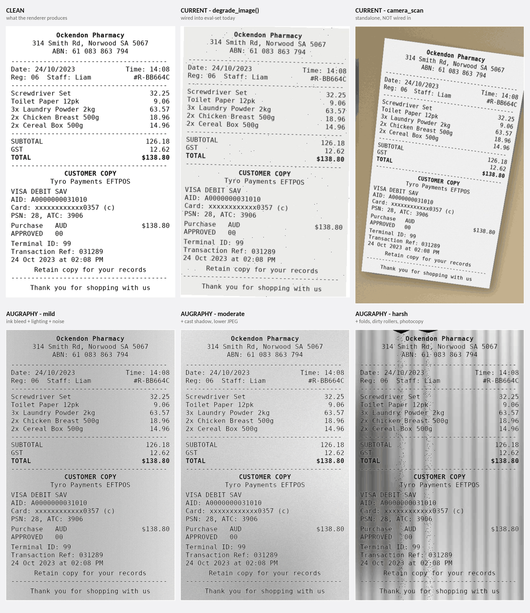

# Tiered Receipt Degradation

**PBI summary — what, why, how.** Allocated: one week.

Related: [`receipt_degradation_design.md`](receipt_degradation_design.md) holds the
full technical design. This document is the stakeholder-facing rationale and
delivery plan.

---

## Summary

The benchmark's degraded image set is meant to predict how a vision-language
model performs on what users actually submit. Today it applies one mild effect
uniformly to all three document types. That models a workflow nobody has: it
lightly damages bank statements and invoices, which in reality arrive pristine,
while giving receipts — the only type users photograph — the same gentle
treatment.

This work makes degradation **receipt-only** and **tiered**, and rebuilds it on
a realistic phone-photo model. The degraded set becomes 55 receipts at three
declared severity levels, with duplicated ground truth, replacing the current
uniform set of 165.

---

## What we are changing

| | Today | After |
|---|---|---|
| Which documents are degraded | All 3 types (165 docs) | Receipts only (55 docs × 3 tiers) |
| Degradation model | 7 mild PIL effects: tint, contrast, brightness, blur, ±2° rotate, salt-and-pepper, JPEG | Augraphy paper/ink damage, then perspective warp onto a desk with camera artefacts |
| Severity | Single fixed level | Three declared tiers: light, moderate, heavy |
| Geometry | Flat page, square to camera | Tilted trapezoid on a background, as photographed |
| Reporting granularity | One aggregate accuracy figure | Accuracy per severity tier |
| Configuration | Python constants merged over YAML | YAML only, every key required |

Two code paths exist today. The weaker one (`degrade_image()`) is wired into the
pipeline; the stronger one (`degrade_camera_scan.py`) models a genuine phone
photo but is connected to nothing and handles receipts only. This work deletes
the first and promotes the second.

---

## Why we are changing it

### 1. The current model tests the wrong thing

Bank statements and invoices reach the business as clean PDFs or printouts.
Degrading them measures robustness to damage that does not occur, spending a
third of the eval budget each on two non-problems. Receipts are the documents
that arrive creased, shadowed, and photographed at an angle on a desk.

### 2. The realism gap is geometric, and we already solved it

This was established empirically, and it redirected the approach. A comparison
sheet was rendered over one corpus receipt through every available option:



**Every Augraphy effect is a flat-page effect.** Ink bleed, lighting gradients,
cast shadows, folds — all treat the document as a rectangle facing the camera
square-on. None produce perspective, a background, or framing.

But comparing the top-middle tile (what the benchmark uses today) with the
top-right (the unwired camera-scan path) shows the dominant gap is exactly that
geometry. Adding Augraphy alone would not have closed it. The existing
camera-scan code does, and has done since it was written.

The conclusion: use both, each for what the other cannot do — Augraphy for paper
and ink character, the camera-scan warp for geometry and framing.

### 3. One number hides where models actually fail

A single degraded set yields a single accuracy figure. Three declared tiers
yield a curve — "94% light, 81% moderate, 58% heavy" — which shows *where* a
model degrades, not merely *that* it does. That is the difference between a
number and a diagnosis, and it is what makes the benchmark actionable when
comparing candidate models.

### Why it is cheap

Scoring is **value-F1**: a field is judged on whether the extracted string is
correct, not on where it sits on the page. Ground truth is therefore invariant
to any geometric or photometric distortion. We can distort images arbitrarily
without re-labelling anything and without any risk to label accuracy. This is
what makes an ambitious degradation model a one-week job rather than a project.

---

## How we are changing it

### Approach

Augraphy damages the flat page **before** the warp; camera effects apply
**after**, to the whole frame:

```
clean receipt (flat)
  ↓  Augraphy ink phase     — ink bleed, faded toner      } damage to the
  ↓  Augraphy paper phase   — creases, stains, texture    } paper itself
  ↓  camera warp            — desk, perspective, shadow
  ↓  camera photometrics    — lighting, blur, noise, JPEG } the act of
degraded variant                                          } photographing
```

This ordering is load-bearing. A crease belongs to the paper and must be warped
*with* the page; painting it flat across an already-tilted photo would read as a
defect in the image rather than in the document.

### Structure

The camera-scan logic moves from a hand-run root script into
`generators/degradation/`, split into three independently testable units: tier
configuration and validation, the Augraphy augmentation registry, and the
camera warp.

Severity tiers are declared entirely in `config/generation_config.yml`. Every
key is required — a missing one fails at startup with a diagnostic naming what
is wrong, where to fix it, what a valid value looks like, and how to recover.
Retuning severity is a configuration edit, never a code change.

### Output

```
degraded_<date>/
  CASE001_receipt_v1.png  …  CASE055_receipt_v3.png   (165 images)
  ground_truth.csv                                    (165 rows)
  ground_truth.jsonl
```

Each variant's ground-truth row carries field values identical to its source
receipt, differing only in the image filename. Case IDs are unchanged, so
existing receipt→bank-statement transaction linking continues to resolve.

---

## Delivery plan

| Day | Work | Done when |
|---|---|---|
| 1 | Add Augraphy and its 15 transitive dependencies to the environment; pin NumPy (Augraphy's `numba` caps it at ≤2.4). Delete the old degradation path and its config. | Pixel snapshots still match after the NumPy pin, proving the downgrade does not alter rendered output. |
| 2 | Tier configuration module: schema, validation, fail-fast diagnostics. Author the three tiers in YAML. | Every invalid-config path raises a four-element diagnostic, with tests asserting all four. |
| 3 | Augraphy registry and the camera warp module, parameterised per tier. | Same case and tier rendered twice produces byte-identical output. |
| 4 | Wire into the eval-set export: three variants per receipt, duplicated ground-truth rows. | Correct image and row counts; all variants of a case carry identical field values; case IDs still resolve against transaction links. |
| 5 | Regenerate the comparison sheet across all three tiers and calibrate. Update README, CLAUDE.md, and environment comments. | Full suite green, `ruff` and `mypy` clean, no documentation describing deleted behaviour. |

The first day is deliberately the environment and the deletion, because both
carry the risk of surprise: a dependency that will not resolve, or a NumPy
downgrade that shifts rendered pixels. Finding either on day one leaves four
days to react; finding it on day four does not.

---

## Risks

| Risk | Likelihood | Mitigation |
|---|---|---|
| NumPy downgrade changes rendered output | Low | Renderers draw through PIL, not NumPy. Verified on day 1 by re-running pixel snapshots — this is proven, not assumed. |
| Tier severity is miscalibrated | **Medium** | No real phone photos of Australian receipts exist to calibrate against, so the heavy tier is informed judgement. Mitigated by regenerating the visual comparison on day 5 and tuning; all parameters are YAML, so retuning is cheap and repeatable. |
| Augraphy dependencies unavailable in PROD | ~~Medium~~ **Closed** | Every package confirmed available. PROD already carries `requests` 2.34.2, which satisfies `urllib3`, `idna`, `certifi` and `charset-normalizer`, so only 13 need mirroring: `augraphy==8.2.6`, `numpy==2.3.5`, and the nine `scikit`/`numba` transitives plus `narwhals`. One, `tifffile`, is at a different patch version — harmless, since only `augraphy` itself is pinned and `tifffile` is reached solely via `scikit-image`'s TIFF I/O, which this pipeline never uses. |
| Pipeline reaches out to the network from an air-gapped PROD | **Low** | `requests`/`urllib3`/`idna`/`certifi` are import-time only: `import augraphy` loads every augmentation module, two of which use HTTP, but neither is in the registered allow-list. No network call is made. Registering a downloading augmentation later would change this. |
| Augraphy conflicts with the pinned headless OpenCV | Low | Augraphy declares the full GUI OpenCV build. Installing `--no-deps` keeps the headless build; verified locally, `cv2` continued resolving to the headless package throughout. |

---

## Out of scope

- **Photocopier damage.** Augraphy's dirty-roller and bad-photocopy effects model
  a different story from a phone photograph and are excluded from all three
  tiers. Adding a fourth photocopy tier later is a YAML edit.
- **Degrading bank statements or invoices.** This is the premise of the change,
  not an omission.
- **The document rectifier.** `rectify_camera_scan.py` is unchanged beyond
  repointing its docstrings.

---

## Definition of done

- The degraded eval-set directory contains 55 receipts × 3 tiers with matching
  ground truth, and no bank statements or invoices.
- The old degradation path and its configuration are deleted, not deprecated.
- All degradation parameters live in YAML; a missing key fails at startup with a
  four-element diagnostic.
- Same input and seed produce byte-identical output.
- Full test suite green; `ruff` and `mypy` clean.
- No documentation describes removed behaviour.
